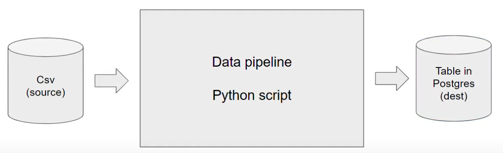
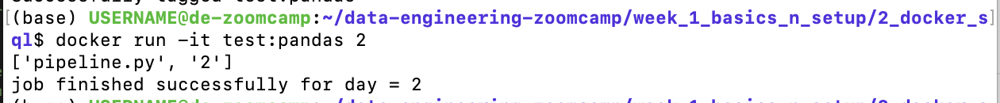
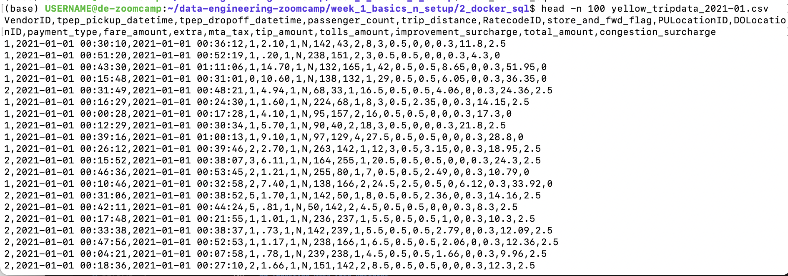
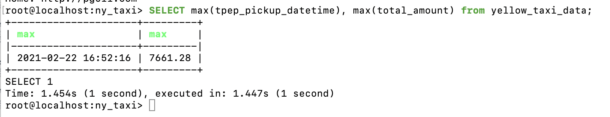
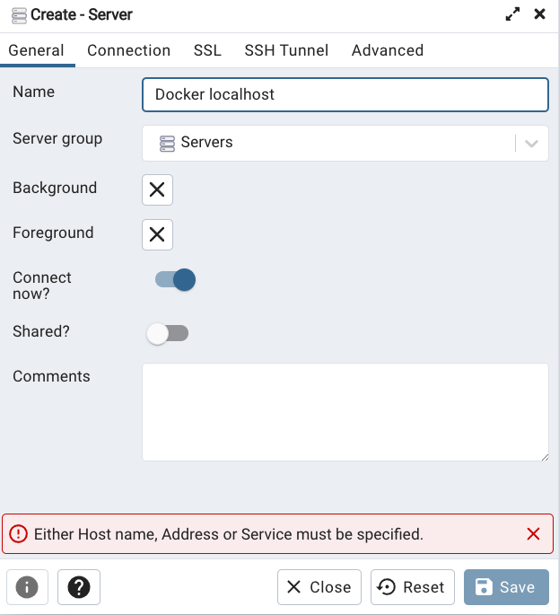

### Table of contents

- [Introduction to Data Engineering](#introduction-to-data-engineering)
- [Docker and Postgres](#docker-and-postgres)
    - [Docker Basic Concepts](#docker-basic-concepts)
    - [Why we should care about Docker](#why-should-we-care-about-docker)
    - [Creating a Docker Image](#creating-a-docker-image)
    - [Creating a Custom Pipeline with Docker](#creating-a-custom-pipeline-with-docker)
    - [Connecting pgAdmin and Postgres](#connecting-pgadmin-and-postgres)


# Introduction to Data Engineering


## Data Pipelines


A **data pipeline** is a service that receives data as input and outputs more data. For example, reading a CSV file, transforming the data somehow and storing it as a table in a PostgreSQL database.



_[Back to the top](#table-of-contents)_

# Docker and Postgres


## Docker Basic Concepts

**Docker** is a containerisation software

On a host computer, you can run multiple docker containers. Container will hold everything needed to run the software independently of what is on the host computer (the operating system, library versions, etc.). E.g. The host computer could be windows, but the container, which runs a data pipeline - holds Ubuntu, and then various other things needed to run that pipeline, for example python 3.9, pandas, a postgres connection library

**Docker images** are a _snapshot_ of a container that we can define to run our software, or in this case our data pipelines. By exporting our Docker images to Cloud providers such as Amazon Web Services or Google Cloud Platform we can run our containers there.


## Why should we care about Docker

- Reproducability -> can use a docker image, take the data pipeline held within the container, and run it in a different environment
- Setting up environments for local experiments (and local tests)
- Integration tests (CI/CD)
- Running pipelines on the cloud (AWS Batch, Kubernetes jobs)
- Spark - spark also enables you to define data pipelines; can specify all the dependencies we need for our pipeline in spark with docker
- Serverless (AWS Lambda, Google functions)

Docker containers are ***stateless***: any changes done inside a container will **NOT** be saved when the container is killed and started again. This is an advantage because it allows us to restore any container to its initial state in a reproducible manner, but you will have to store data elsewhere if you need to do so; a common way to do so is with _volumes_.

>Note: you can learn more about Docker and how to set it up on a Mac [in this link](https://github.com/ziritrion/ml-zoomcamp/blob/11_kserve/notes/05b_virtenvs.md#docker). You may also be interested in a [Docker reference cheatsheet](https://gist.github.com/ziritrion/1842c8a4c4851602a8733bba19ab6050#docker).

## Creating a Docker Image

The below finds and runs the existing python:3.9 docker image

```bash
docker run -it python:3.9
```

- Can then type python code into the command line. However, we need pandas for our pipeline and it isn't installed with the above image - need to find a way for bash to install pandas

```bash
docker run -it --entrypoint=bash  python:3.9

pip install pandas
python
```

- The --entrypoint=bash argument means that instead of having a python prompt, we have a bash prompt - which we can use to pip install pandas.
- Then, type 'python' in the bash prompt to enter the python3.9 prompt

```python
import pandas
pandas.__version__
```

N.b. if you exit the docker image, and then run it again -> won't have pandas pip installed (see notes on Docker containers being ***stateless***)

So, we want to add pandas to the docker image itself. Use a file named: **Dockerfile** to create a new image. See file in 2_docker_sql folder.

```dockerfile
# base docker image that we'll build on
FROM python:3.9.1

# set up our image by installing prerequisites; pandas in this case
RUN pip install pandas 

# define what to do when image first runs - open bash prompt in this case
ENTRYPOINT [ "bash" ]
```

cd to the folder that contains the Dockerfile:
```bash
# Docker build didn't work until I ran this - issue was that I wasn't the owner of the directory 
sudo chown -R $USER 2_docker_sql

# -t -> the image name is 'test' and it's tag is 'pandas'. If the tag isn't specified, it defaults to 'latest'
# . means we want to build the docker image in this directory
docker build -t test:pandas .
```

Once the docker image has been built, can then run it:

```bash
# -it -> run interactively
docker run -it test:pandas
```

## Creating a custom pipeline with Docker 

We'll create a dummy `pipeline.py` python script that receives an argument and prints it.

```python
import sys
import pandas # we don't need this but it's useful for the example

# print arguments
print(sys.argv)

# argument 0 is the name of the file
# argumment 1 contains the actual first argument we care about
day = sys.argv[1]

# cool pandas stuff goes here

# print a sentence with the argument
print(f'job finished successfully for day = {day}')
```

We can run this script with `python pipeline.py <some_number>` and it should print 2 lines:
* `['pipeline.py', '<some_number>']`
* `job finished successfully for day = <some_number>`

Can then containerize it by creating a Docker image. Create the folllowing `Dockerfile` file:

```dockerfile
# base Docker image that we will build on
FROM python:3.9.1

# set up our image by installing prerequisites; pandas in this case
RUN pip install pandas

# set up the working directory inside the container
WORKDIR /app
# copy the script to the container. 1st name is source file, 2nd is destination
COPY pipeline.py pipeline.py

# define what to do first when the container runs
# in this example, we will just run the script
ENTRYPOINT ["python", "pipeline.py"]
```

Build the image again:

```ssh
docker build -t test:pandas .
```

Can now run the container and pass an argument to it, so that our pipeline will receive it:

```ssh
docker run -it test:pandas <some_number>
```

You should get the same output you did when you ran the pipeline script by itself.



## Running Postgres in a Container 

You can use docker compose to run a containerised version of Postgres and PGadmin

Create a `docker-compose.yaml` file:

```docker-compose
services:
  pgdatabase:
    image: postgres:13
    environment:
      - POSTGRES_USER=root
      - POSTGRES_PASSWORD=root
      - POSTGRES_DB=ny_taxi
    volumes:
      - "./ny_taxi_postgres_data:/var/lib/postgresql/data:rw"
    ports:
      - "5432:5432"
  pgadmin:
    image: dpage/pgadmin4
    environment:
      - PGADMIN_DEFAULT_EMAIL=admin@admin.com
      - PGADMIN_DEFAULT_PASSWORD=root
    ports:
      - "8080:80"
```

- This calls on existing docker images, and sets a few environment variables to it as well as a volume for storing data.

You can then run the following in bash, once you've cd'd to the folder that contains the .yaml file:

```bash
# -d means running it in detached mode - which means that the services will run in the background, and you'll be able to continue using the terminal for other commands without being attached to the containers' output
docker-compose up -d
```

- The Docker Compose tool will read the configuration from the docker-compose.yaml file, create and start the specified services, networks, and volumes as defined in the file. If the services defined in your docker-compose.yaml file are not already built, Docker Compose will attempt to build them before starting.

**Alternative approach...<br/>**
...you can simply use docker to run postgres, using the following command:

```bash
docker run -it \
    -e POSTGRES_USER="root" \
    -e POSTGRES_PASSWORD="root" \
    -e POSTGRES_DB="ny_taxi" \
    -v $(pwd)/ny_taxi_postgres_data:/var/lib/postgresql/data \
    -p 5432:5432 \
    postgres:13
```
N.b. I used /home/USERNAME/data-engineering-zoomcamp/week_1_basics_n_setup/2_docker_sql instead of `$(pwd)` -> should be the same thing (see below), but `$(pwd)` wasn't working for me 

* The container needs 3 environment variables (-e):
    * `POSTGRES_USER` is the username for logging into the database. We chose `root`.
    * `POSTGRES_PASSWORD` is the password for the database. We chose `root`
        * ***IMPORTANT: These values are only meant for testing. Please change them for any serious project.***
    * `POSTGRES_DB` is the name that we will give the database. We chose `ny_taxi`.
* `-v` points to the volume directory. The colon `:` separates the first part (path to the folder in the host computer) from the second part (path to the folder inside the container).
    * Path names must be absolute. If you're in a UNIX-like system, you can use `pwd` to print you local folder as a shortcut; this example should work with both `bash` and `zsh` shells, but `fish` will require you to remove the `$`.
    * This command will only work if you run it from a directory which contains the `ny_taxi_postgres_data` subdirectory you created above.
    * A volume is designed to persist the Postgres data - ./ny_taxi_postgres_data is mounted to /var/lib/postgresql/data inside the container. This ensures that the data in the PostgreSQL database is stored on the host machine and survives container restarts.
* The `-p` is for port mapping. We map the default Postgres port to the same port in the host.
* The last argument is the image name and tag. We run the official `postgres` image on its version `13`.

Once the container is running, we can log into our database with [pgcli](https://www.pgcli.com/) with the following command:

```bash
pgcli -h localhost -p 5432 -u root -d ny_taxi
```
* `-h` is the host. Since we're running locally we can use `localhost`.
* `-p` is the port.
* `-u` is the username.
* `-d` is the database name.
* The password is not provided; it will be requested after running the command.

## Ingesting Data into Postgres

Ingesting data from this csv:
From here: https://www1.nyc.gov/site/tlc/about/tlc-trip-record-data.page
Data dictionary here: https://www1.nyc.gov/assets/tlc/downloads/pdf/data_dictionary_trip_records_yellow.pdf 



1.3million rows in the dataset.

We now create a Jupyter Notebook `upload-data.ipynb` file which we will use to read a CSV file and export it to Postgres.

>Note: knowledge of Jupyter Notebook, Python environment management and Pandas is asumed in these notes. To learn more about pandas, can use [this](https://github.com/DataTalksClub/machine-learning-zoomcamp/blob/master/01-intro/09-pandas.md) section from the machine learning zommcamp, or you can check [this link](https://gist.github.com/ziritrion/9b80e47956adc0f20ecce209d494cd0a#pandas) for a Pandas cheatsheet and [this link](https://gist.github.com/ziritrion/8024025672ea92b8bdeb320d6015aa0d) for a Conda cheatsheet for Python environment management.

Check the completed `upload-data.ipynb` for a detailed guide. You will need to have the CSV file referenced above (yellow_tripdata_2021-01.csv) in the same directory and the `ny_taxi_postgres_data` subdirectory.

## Connecting pgAdmin and Postgres 

Can write queries in the command line:



But that isn't very convenient. **PgAdmin** is a more convenient tool - it is a web-vased GUI used to interact with Postgres database sessions, both locally and with remote servers too. You can use PGAdmin to perform any sort of database administration required for a Postgres database.

### Connecting pgAdmin and Postgres with docker Networking

*will cover docker compose later*

It's possible to run pgAdmin as as container along with the Postgres container, but both containers will have to be in the same _virtual network_ so that they can find each other.

Let's create a virtual Docker network called `pg-network`:

```bash
docker network create pg-network
```

>You can remove the network later with the command `docker network rm pg-network` . You can look at the existing networks with `docker network ls` .

We will now re-run our Postgres container with the added network name and the container network name, so that the pgAdmin container can find it (we'll use `pg-database` for the container name):

```bash
docker run -it \
    -e POSTGRES_USER="root" \
    -e POSTGRES_PASSWORD="root" \
    -e POSTGRES_DB="ny_taxi" \
    -v $(pwd)/ny_taxi_postgres_data:/var/lib/postgresql/data \
    -p 5432:5432 \
    --network=pg-network \
    --name pg-database \
    postgres:13
  ```

We will now run the pgAdmin container on another terminal:

```bash
docker run -it \
    -e PGADMIN_DEFAULT_EMAIL="admin@admin.com" \
    -e PGADMIN_DEFAULT_PASSWORD="root" \
    -p 8080:80 \
    --network=pg-network \
    --name pgadmin \
    dpage/pgadmin4
```
* The container needs 2 environment variables: a login email and a password. We use `admin@admin.com` and `root` in this example.
 * ***IMPORTANT: these are example values for testing and should never be used on production. Change them accordingly when needed.***
* pgAdmin is a web app and its default port is 80; we map it to 8080 in our localhost to avoid any possible conflicts.
* Just like with the Postgres container, we specify a network and a name. However, the name in this example isn't really necessary because there won't be any containers trying to access this particular container.
* The actual image name is `dpage/pgadmin4` .

You should now be able to load pgAdmin on a web browser by browsing to `localhost:8080`. Use the same email and password you used for running the container to log in.

Right-click on _Servers_ on the left sidebar and select _Create_ > _Server..._


Under _General_ give the Server a name and under _Connection_ add the same host name, user and password you used when running the container.




Click on _Save_. You should now be connected to the database.

We will explore using pgAdmin in later lessons.

## Using the Ingestion Script with Docker

Will now export the upload-data .ipynb file to a regular .py and use Docker to run it

### Exporting and testing the script

```bash
jupyter nbconvert --to=script upload-data.ipynb
```

Clean up the script by removing everything we don't need. We will also rename it to `ingest_data.py` and add a few modifications:

* We will use [argparse](https://docs.python.org/3/library/argparse.html) to handle the following command line arguments:
    * Username
    * Password
    * Host
    * Port
    * Database name
    * Table name
    * URL for the CSV file
* The _engine_ we created for connecting to Postgres will be tweaked so that we pass the parameters and build the URL from them, like this:

    ```python
    engine = create_engine(f'postgresql://{user}:{password}@{host}:{port}/{db}')
    ```
* We will also download the CSV using the provided URL argument.

In order to test the script we will have to drop the table we previously created. In pgAdmin, in the sidebar navigate to _Servers > Docker localhost > Databases > ny_taxi > Schemas > public > Tables > yellow_taxi_data_, right click on _yellow_taxi_data_ and select _Query tool_. Introduce the following command:

```sql
DROP TABLE yellow_taxi_data;
```

We are now ready to test the script with the following command:

```bash
python ingest_data.py \
    --user=root \
    --password=root \
    --host=localhost \
    --port=5432 \
    --db=ny_taxi \
    --table_name=yellow_taxi_trips \
    --url="https://github.com/DataTalksClub/nyc-tlc-data/releases/download/yellow/yellow_tripdata_2021-01.csv.gz"
```

* Note that I've created a google cloud bucket to store the csv - didn't have access to https://s3.amazonaws.com/nyc-tlc/trip+data/yellow_tripdata_2021-01.csv 
* Note that we've changed the table name from `yellow_taxi_data` to `yellow_taxi_trips`.

Back in pgAdmin, refresh the Tables and check that `yellow_taxi_trips` was created. You can also run a SQL query to check the contents:

```sql
SELECT
    COUNT(1)
FROM
    yellow_taxi_trips;
```
* This query should return 1,369,765 rows.

### Dockerising the Scripts

Let's modify the [Dockerfile we created before](#creating-a-custom-pipeline-with-docker) to include our `ingest_data.py` script and create a new image:

```dockerfile
FROM python:3.9.1

# We need to install wget to download the csv file
RUN apt-get install wget
# psycopg2 is a postgres db adapter for python: sqlalchemy needs it
RUN pip install pandas sqlalchemy psycopg2

WORKDIR /app
COPY ingest_data.py ingest_data.py 

ENTRYPOINT [ "python", "ingest_data.py" ]
```

Build the image:
```bash
docker build -t taxi_ingest:v001 .
```

And run it:
```bash
docker run -it \
    --network=pg-network \
    taxi_ingest:v001 \
    --user=root \
    --password=root \
    --host=pg-database \
    --port=5432 \
    --db=ny_taxi \
    --table_name=yellow_taxi_trips \
    --url="https://github.com/DataTalksClub/nyc-tlc-data/releases/download/yellow/yellow_tripdata_2021-01.csv.gz"
```

* We need to provide the network for Docker to find the Postgres container. It goes before the name of the image.
* Since Postgres is running on a separate container, the host argument will have to point to the container name of Postgres. Localhost would just point to itself.
* You can drop the table in pgAdmin beforehand if you want, but the script will automatically replace the pre-existing table.