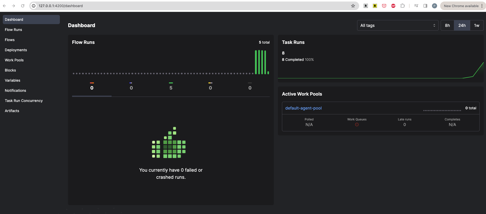
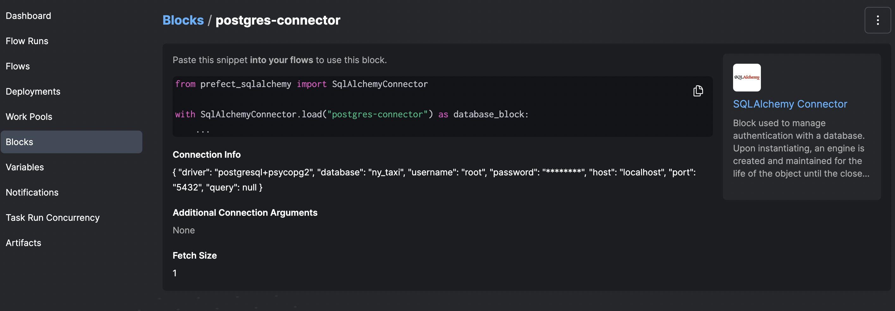
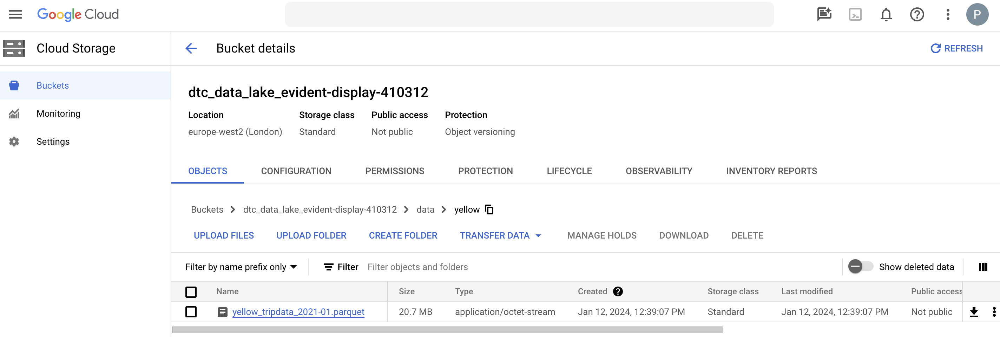

## Table of Conntents

- [Data Lakes](#what-is-a-data-lake)
- [Intro to workflow orchestration](#introduction-to-workflow-orchestration)
    - [Create Venv and Install Dependencies](#create-venv--install-dependencies)
    - [Transform Script into a Prefect Flow](#transform-script-into-a-prefect-flow)
- [ETL with GCP and Prefect](#etl-with-gcp-and-prefect)


# What is a Data Lake?

### What is a Data Lake?
A Data Lake consists of a central repository where any type of data, either structured or unstructured, can be stored. The main idea behind a Data Lake is to ingest and make data available as quickly as possible inside an organization.

Generally, when you're storing data into a data lake you will associate some sort of metadata for faster access.

Data Lake solutions should be secure and should scale, and the hardware should be inexpensive (so you can store more dater, more quickly)


### Data Lake vs. Data Warehouse

Data Lake - unstructured data
- Users: data scientists / data analysts
- Use cases - stream processing, machine learning, real time analysis
- In summary: raw data; large amounts of data; undefined

Data Warehouse - structured data
- Users: business analysts
- Use cases - batch processing, BI, reporting
- In summary: refined pre-processed data; smaller volume of data; relational

### Extract-Transform-Load (ETL) vs. Extract-Load-Transform (ELT)
ETL is usually a Data Warehouse solution, used mainly for small amount of data as a schema-on-write approach. On the other hand, ELT is a Data Lake solution, employed for large amounts of data as a schema-on-read approach.

### Data Lake Potential Pitfalls

- Conversion into a data swamp, because:
    - There's no versioning
    - Incompatible schemas for the same data without versioning
    - No associated metadata
    - Joins not possible 

# [Introduction to Workflow orchestration](https://www.youtube.com/watch?v=8oLs6pzHp68&list=PL3MmuxUbc_hJed7dXYoJw8DoCuVHhGEQb&index=17)

### What is a dataflow?

A dataflow defines all extraction and processing steps that the data will be submitted to, also detailing any transformation and intermediate states of the dataset. For example, in an ETL process, a dataset is first extracted (E) from some source (e.g., website, API, etc), then transformed (T) (e.g., dealing with corrupted or missing values, joining datasets, datatype conversion, etc) and finally loaded (L) to some type of storage (e.g., data warehouse). For more details, read [What is Data Flow?](https://www.modernanalyst.com/Careers/InterviewQuestions/tabid/128/ID/6119/What-is-a-Data-Flow.aspx) and [Extract, transform, load](https://en.wikipedia.org/wiki/Extract,_transform,_load).

### What is workflow orchestration?

A workflow orchestration tool allows us to manage and visualize dataflows, while ensuring that they will be run according to a set of predefined rules. A good workflow orchestration tool makes it easy to schedule or execute dataflows remotely, handle faults, integrate with external services, increase reliability, etc. For more information, read [Workflow Orchestration vs. Data Orchestration — Are Those Different?](https://towardsdatascience.com/workflow-orchestration-vs-data-orchestration-are-those-different-a661c46d2e88) and [Your Code Will Fail (but that’s ok)](https://medium.com/the-prefect-blog/your-code-will-fail-but-thats-ok-f0327a208dbe).

### Core Features of a good Workflow Orchestration System

- Remote execution
- Scheduling
- Retries
- Caching
- Integrating with external systems (APIs, databases)
- Ad hoc runs
- Parameterisation
- Alerting you when something fail

# Introduction to Prefect Concepts

## Create Venv + Install Dependencies

Create a python environment in the relevant folder:

```bash
conda create -n zoomcamp python=3.9
conda activate zoomcamp  
```

To leave the environment:

```bash
source deactivate
```

See requirements.txt for the dependencies

```bash
pip install -r requirements.txt
```

The requirements.txt file:

```requirements.txt
pandas==1.5.2
prefect==2.7.7
prefect-sqlalchemy==0.2.2
prefect-gcp[cloud_storage]==0.2.3
protobuf==4.21.11
pyarrow=10.0.1
pandas-gbq==0.18.1
psycopg2-binary==2.9.5
sqlalchemy=1.4.46
```

## Transform Script into a Prefect Flow


### Step 1

The `ingest_data_wk_2.py` file (see 1.2 `ingest_data.py` file) loads data from a csv into a postgres database (as was shown in more detail in week 1). However, we have to run this script manually - the aim would be to run the script on a schedule without the need to manually trigger it.

So, we need to adapt this script so that it can run on a schedule

### Step 2

- flow -> The most basic python object, a container of workflow logic that allows you to interact with and understand the state of your workflo
- tasks -> Flows can contain tasks. Tasks can receive metadata about upstream dependencies - which gives you the ability to have a task wait on the completion of another task (the dependency) before executing

Transform the script `ingest_data.py` from week 1 (1.2) as follows to create a Prefect flow:

```python
from prefect import flow, task
```

Move all code under ```if __name__ == '__main__``` to a function ```main_flow()```. Then, we use the ```flow``` decorator to indicate that ```main_flow()``` is a Prefect flow. According to the instructor, a flow consists of a container for workflow logic that we can use to interact and understand the state of the workflow. They receive inputs, perform a set of tasks and returns outputs. In addition, we use the ```@task``` decorator to indicate that ```ingest()``` is a task from our flow. See [ingest_data_flow.py](./ingest_data_flow.py). Then, we run this new code:

```python
ingest_data_wk_2.py
```

Output looks something like this: A flow has been created (I commented out the While loop - so only first 1000 row chunk imported into postgres database)

```bash
16:05:11.752 | INFO    | Task run 'ingest_data-0' - Finished in state Completed()
16:05:11.799 | INFO    | Flow run 'radiant-auk' - Finished in state Completed('All states completed.')
```

### Step 3

Transform the script into ETL. Currently, the code performs everything all at once. We can break ```ingest()``` into three different tasks: Extract (E), Transform (T) and Load (L). See [ingest_data_flow_etl.py](../02-workflow-orchestration/ingest_data_flow_etl.py). The output of this ETL script is something like:

In the script - note that you can have subflows (flows held within flows)

```bash
17:09:44.049 | INFO    | Task run 'extract_data-0' - Finished in state Completed()
17:09:44.083 | INFO    | Flow run 'inescapable-prawn' - Created task run 'transform_data-0' for task 'transform_data'
17:09:44.084 | INFO    | Flow run 'inescapable-prawn' - Executing 'transform_data-0' immediately...
17:09:44.165 | INFO    | Task run 'transform_data-0' - pre: missing passenger count: 1973
17:09:44.183 | INFO    | Task run 'transform_data-0' - post: missing passenger count: 0
17:09:44.228 | INFO    | Task run 'transform_data-0' - Finished in state Completed()
17:09:44.267 | INFO    | Flow run 'inescapable-prawn' - Created task run 'ingest_data-0' for task 'ingest_data'
17:09:44.268 | INFO    | Flow run 'inescapable-prawn' - Executing 'ingest_data-0' immediately...
17:09:53.749 | INFO    | Task run 'ingest_data-0' - Finished in state Completed()
17:09:53.797 | INFO    | Flow run 'inescapable-prawn' - Finished in state Completed('All states completed.')
```

Note that now we have the three tasks (extract_data-0, transform_data-0-0, ingest_data-0) instead of a single task (ingest_data-0).
Note that the missing passenger count was 1973, the data is then transformed, and there are no longer any missing passenger rows

### Step 4

Interacting with the Prefect Server - dealing with the UI

To configure Prefect to communicate with the server (run prefect server start to see if the url has changed)

```bash
prefect config set PREFECT_API_URL=http://127.0.0.1:4200/api
```

Then Run:

```bash
prefect server start
```

And then check out the dashboard at http://127.0.0.1:4200

The Prefect Server Dashboard:
- You can also see flow runs etc.



Prefect Orion UI allows us to see our flows in an interactive an intuitive web interface. It summarizes the state of our workflows. Besides, we also have some extra information, such as:

* Task Run Concurrency, which can be configured by adding tags to tasks.

* Notifications, that alerts us when something goes wrong.

* Blocks, which allows us to store configurations and use them as an interface for interacting with external systems. In other words, we can securely store authentication credentials for different services, without the need to specify such credentials directly in our codes or command lines. **[Docs on Blocks](https://docs.prefect.io/latest/concepts/blocks/)**

### Step 5

We want to create a new block for our Postgres connector. In Prefect Server UI, we first click in "Blocks" and then "Add Block +". Next, we add a SQLAlchemyConnector, and fill the corresponding form and click on "Create".
* Block Name -> postgres-connector
* SyncDriver & [postgres+psycopg2](https://docs.sqlalchemy.org/en/14/dialects/postgresql.html#module-sqlalchemy.dialects.postgresql.psycopg2)
* Database -> ny_taxi
* Username -> root
* Password -> root
* Host -> localhost
* port -> 5432



We've pip installed prefect-alchemy as part of our requirements.txt, so we can just add the below code snippet - see the difference between `ingest_data_flow_etl.py` and `ingest_data_flow_etl_with_sql_block.py` (the difference is in the load_data() function - with some v small changes to accomodate these changes elsewhere). It means we don't have to hard code the user, password, host, port or db anymore:

```python
from prefect_sqlalchemy import SqlAlchemyConnector

with SqlAlchemyConnector.load("postgres-connector") as database_block:
    ...
```

Here is the output. You'll also see 2 new flow runs (the 'Ingest Flow' and the 'Subflow' in the Prefect Server UI):


```bash
18:07:35.586 | INFO    | prefect.engine - Created flow run 'heavy-jacamar' for flow 'Ingest flow'
18:07:35.588 | INFO    | Flow run 'heavy-jacamar' - View at http://127.0.0.1:4200/flow-runs/flow-run/f02329d7-6ec3-43cb-9eb5-e2ecc24bb554
18:07:35.876 | INFO    | Flow run 'heavy-jacamar' - Created subflow run 'beautiful-macaw' for flow 'Subflow'
18:07:35.878 | INFO    | Flow run 'beautiful-macaw' - View at http://127.0.0.1:4200/flow-runs/flow-run/68e1afec-c92b-431a-a7d1-0c6371692851
18:07:35.990 | INFO    | Flow run 'beautiful-macaw' - Logging Subflow for: wk_2_yellow_taxi_trips
18:07:36.063 | INFO    | Flow run 'beautiful-macaw' - Finished in state Completed()
18:07:36.107 | INFO    | Flow run 'heavy-jacamar' - Created task run 'extract_data-0' for task 'extract_data'
18:07:36.109 | INFO    | Flow run 'heavy-jacamar' - Executing 'extract_data-0' immediately...
18:07:36.189 | INFO    | Task run 'extract_data-0' - Finished in state Cached(type=COMPLETED)
18:07:36.850 | INFO    | Flow run 'heavy-jacamar' - Created task run 'transform_data-0' for task 'transform_data'
18:07:36.851 | INFO    | Flow run 'heavy-jacamar' - Executing 'transform_data-0' immediately...
18:07:36.944 | INFO    | Task run 'transform_data-0' - pre: missing passenger count: 1973
18:07:36.965 | INFO    | Task run 'transform_data-0' - post: missing passenger count: 0
18:07:37.015 | INFO    | Task run 'transform_data-0' - Finished in state Completed()
18:07:37.055 | INFO    | Flow run 'heavy-jacamar' - Created task run 'load_data-0' for task 'load_data'
18:07:37.056 | INFO    | Flow run 'heavy-jacamar' - Executing 'load_data-0' immediately...
18:07:37.280 | INFO    | Task run 'load_data-0' - Created a new engine.
18:07:37.297 | INFO    | Task run 'load_data-0' - Created a new connection.
18:07:46.999 | INFO    | Task run 'load_data-0' - Finished in state Completed()
18:07:47.049 | INFO    | Flow run 'heavy-jacamar' - Finished in state Completed('All states completed.')
```


# ETL with GCP and Prefect

### Step 1

 write an ETL script for saving data locally and uploading it to GCP (see [etl_web_to_gcs.py](../02-workflow-orchestration/02_gcp/etl_web_to_gcs.py)).

### Step 2

Create a bucket in GCP. Can use Terraform for this - remember to set GOOGLE_APPLICATION_CREDENTIALS to location of authentication key JSON file.

Bucket created called: dtc_data_lake_evident-display-410312

### Step 3

Run Prefect Server UI from the terminal.

```
prefect server start
```

### Step 3

Create a Prefect Block to store our GCP credentials (for generating GCP credentials, see `DE Zoomcamp 1.3.1 - Introduction to Terraform Concepts & GCP Pre-Requisites`), because blocks allow us to reuse configuration with external services, doing it in a secure way.

In the Prefect Orion UI click on "Blocks" and then find the GCS Bucket Block.

Important note: if GCS Bucket is not available, go to the terminal and run:

```bash
prefect block register -m prefect_gcp
```
* This should create a GCS Bucket Block and a GCP Credentials Block

### Step 4

Configure a GCS Bucket Block and a GCP Credentials Block:

**GCS Bucket Block**:
- Block Name: zoomcamp-gcs
- Bucket (*add the name of the gcs bucket here*): dtc_data_lake_evident-display-410312
- Select/Create credentials block (see below)
    - So the block is created within the GCS Bucket block
- Hit Create
- You then get this code snippet (with the caption: Paste this snippet into your flows to use this block.)
    from prefect_gcp.cloud_storage import GcsBucket
    gcp_cloud_storage_bucket_block = GcsBucket.load("zoomcamp-gcs")

**GCP Credentials Block**:
- Block Name: zoomcamp-gcp-credentials
- Service Account File: /home/USERNAME/.gc/evident-display-410312-6d17d29a1ecf.json
    - I chose to use the path of the json file that stores my credentials. Could also have pasted the contents directly in the blue box under "The contents of the keyfile as dict".


### Step 5

Running `etl_web_to_gcs.py` file where the `write_gcs()` function makes use of the blocks we've created:

```python
@task()
def write_gcs(path: Path) -> None:
    """Uploading local parquet file to GCS"""
    gcs_block = GcsBucket.load("zooomcamp-gcs")
    gcs_block.upload_from_path(
        from_path=path,
        to_path=path
    )
    return
```

### Step 6

Check the uploaded data in GCP

