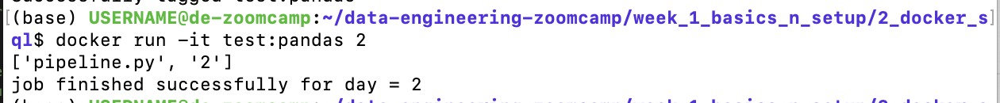
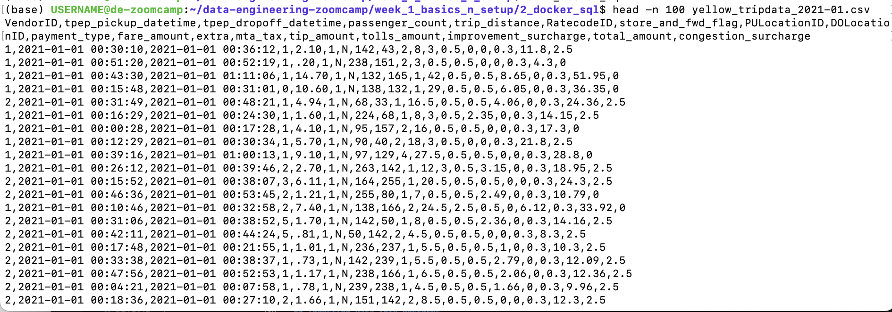
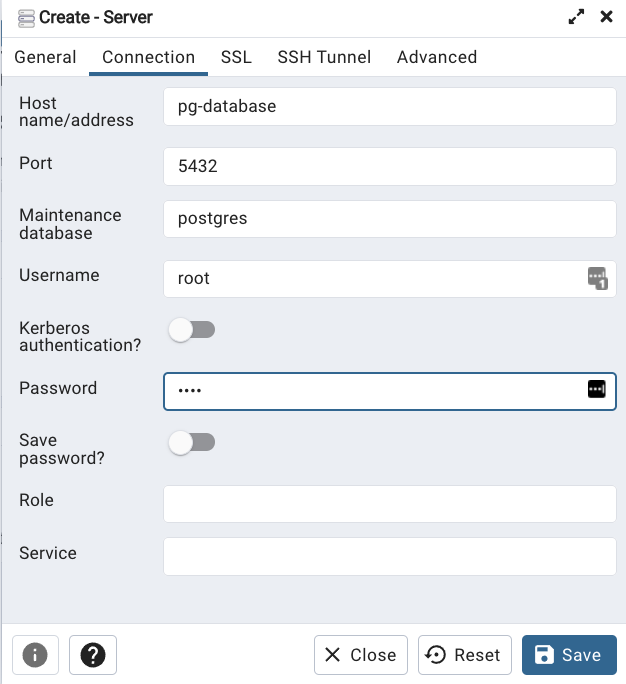

### Table of contents

- [Introduction to Data Engineering](#introduction-to-data-engineering)
- [Docker and Postgres](#docker-and-postgres)
    - [Docker Basic Concepts](#docker-basic-concepts)
    - [Why we should care about Docker](#why-should-we-care-about-docker)
    - [Creating a Docker Image](#creating-a-docker-image)
    - [Creating a Custom Pipeline with Docker](#creating-a-custom-pipeline-with-docker)
    - [Connecting pgAdmin and Postgres with Docker Networking](#connecting-pgadmin-and-postgres-with-docker-networking)
    - [Using the Ingestion Script with Docker](#using-the-ingestion-script-with-docker)
      - [Exporting and Testing the Script](#exporting-and-testing-the-script)
      - [Dockerizing the Script](#dockerising-the-script)
    - [Running Postgres and PgAdmin with Docker-Compose](#running-postgres-and-pgadmin-with-docker-compose)
    - [SQL Refresher - NEED TO ADD NOTES](#sql-refresher)
  - [Terraform and GCP Set Up](#terraform--gcp-set-up)
  - [Week 1 Homework](#week-1-hw)
  


# Introduction to Data Engineering


## Data Pipelines


A **data pipeline** is a service that receives data as input and outputs more data. For example, reading a CSV file, transforming the data somehow and storing it as a table in a PostgreSQL database.


_[Back to the top](#table-of-contents)_

# Docker and Postgres


## Docker Basic Concepts

**Docker** is a containerisation software

On a host computer, you can run multiple docker containers. Container will hold everything needed to run the software independently of what is on the host computer (the operating system, library versions, etc.). E.g. The host computer could be windows, but the container, which runs a data pipeline - holds Ubuntu, and then various other things needed to run that pipeline, for example python 3.9, pandas, a postgres connection library

**Docker images** are a _snapshot_ of a container that we can define to run our software, or in this case our data pipelines. By exporting our Docker images to Cloud providers such as Amazon Web Services or Google Cloud Platform we can run our containers there.


## Why should we care about Docker

- Reproducability -> can use a docker image, take the data pipeline held within the container, and run it in a different environment
- Setting up environments for local experiments (and local tests)
- Integration tests (CI/CD)
- Running pipelines on the cloud (AWS Batch, Kubernetes jobs)
- Spark - spark also enables you to define data pipelines; can specify all the dependencies we need for our pipeline in spark with docker
- Serverless (AWS Lambda, Google functions)

Docker containers are ***stateless***: any changes done inside a container will **NOT** be saved when the container is killed and started again. This is an advantage because it allows us to restore any container to its initial state in a reproducible manner, but you will have to store data elsewhere if you need to do so; a common way to do so is with _volumes_.

>Note: you can learn more about Docker and how to set it up on a Mac [in this link](https://github.com/ziritrion/ml-zoomcamp/blob/11_kserve/notes/05b_virtenvs.md#docker). You may also be interested in a [Docker reference cheatsheet](https://gist.github.com/ziritrion/1842c8a4c4851602a8733bba19ab6050#docker).

## Creating a Docker Image

The below finds and runs the existing python:3.9 docker image

```bash
docker run -it python:3.9
```

- Can then type python code into the command line. However, we need pandas for our pipeline and it isn't installed with the above image - need to find a way for bash to install pandas

```bash
docker run -it --entrypoint=bash  python:3.9

pip install pandas
python
```

- The --entrypoint=bash argument means that instead of having a python prompt, we have a bash prompt - which we can use to pip install pandas.
- Then, type 'python' in the bash prompt to enter the python3.9 prompt

```python
import pandas
pandas.__version__
```

N.b. if you exit the docker image, and then run it again -> won't have pandas pip installed (see notes on Docker containers being ***stateless***)

So, we want to add pandas to the docker image itself. Use a file named: **Dockerfile** to create a new image. See file in 2_docker_sql folder.

```dockerfile
# base docker image that we'll build on
FROM python:3.9.1

# set up our image by installing prerequisites; pandas in this case
RUN pip install pandas 

# define what to do when image first runs - open bash prompt in this case
ENTRYPOINT [ "bash" ]
```

cd to the folder that contains the Dockerfile:
```bash
# Docker build didn't work until I ran this - issue was that I wasn't the owner of the directory 
sudo chown -R $USER 2_docker_sql

# -t -> the image name is 'test' and it's tag is 'pandas'. If the tag isn't specified, it defaults to 'latest'
# . means we want to build the docker image in this directory
docker build -t test:pandas .
```

Once the docker image has been built, can then run it:

```bash
# -it -> run interactively
docker run -it test:pandas
```

## Creating a custom pipeline with Docker 

We'll create a dummy `pipeline.py` python script that receives an argument and prints it.

```python
import sys
import pandas # we don't need this but it's useful for the example

# print arguments
print(sys.argv)

# argument 0 is the name of the file
# argumment 1 contains the actual first argument we care about
day = sys.argv[1]

# cool pandas stuff goes here

# print a sentence with the argument
print(f'job finished successfully for day = {day}')
```

We can run this script with `python pipeline.py <some_number>` and it should print 2 lines:
* `['pipeline.py', '<some_number>']`
* `job finished successfully for day = <some_number>`

Can then containerize it by creating a Docker image. Create the folllowing `Dockerfile` file:

```dockerfile
# base Docker image that we will build on
FROM python:3.9.1

# set up our image by installing prerequisites; pandas in this case
RUN pip install pandas

# set up the working directory inside the container
WORKDIR /app
# copy the script to the container. 1st name is source file, 2nd is destination
COPY pipeline.py pipeline.py

# define what to do first when the container runs
# in this example, we will just run the script
ENTRYPOINT ["python", "pipeline.py"]
```

Build the image again:

```ssh
docker build -t test:pandas .
```

Can now run the container and pass an argument to it, so that our pipeline will receive it:

```ssh
docker run -it test:pandas <some_number>
```

You should get the same output you did when you ran the pipeline script by itself.



## Running Postgres in a Container 

You can use docker compose to run a containerised version of Postgres and PGadmin

Create a `docker-compose.yaml` file:

```docker-compose
services:
  pgdatabase:
    image: postgres:13
    environment:
      - POSTGRES_USER=root
      - POSTGRES_PASSWORD=root
      - POSTGRES_DB=ny_taxi
    volumes:
      - "./ny_taxi_postgres_data:/var/lib/postgresql/data:rw"
    ports:
      - "5432:5432"
  pgadmin:
    image: dpage/pgadmin4
    environment:
      - PGADMIN_DEFAULT_EMAIL=admin@admin.com
      - PGADMIN_DEFAULT_PASSWORD=root
    ports:
      - "8080:80"
```

- This calls on existing docker images, and sets a few environment variables to it as well as a volume for storing data.

You can then run the following in bash, once you've cd'd to the folder that contains the .yaml file:

```bash
# -d means running it in detached mode - which means that the services will run in the background, and you'll be able to continue using the terminal for other commands without being attached to the containers' output
docker-compose up -d
```

- The Docker Compose tool will read the configuration from the docker-compose.yaml file, create and start the specified services, networks, and volumes as defined in the file. If the services defined in your docker-compose.yaml file are not already built, Docker Compose will attempt to build them before starting.

**Alternative approach...<br/>**
...you can simply use docker to run postgres, using the following command:

```bash
docker run -it \
    -e POSTGRES_USER="root" \
    -e POSTGRES_PASSWORD="root" \
    -e POSTGRES_DB="ny_taxi" \
    -v $(pwd)/ny_taxi_postgres_data:/var/lib/postgresql/data \
    -p 5432:5432 \
    postgres:13
```
N.b. I used /home/USERNAME/data-engineering-zoomcamp/week_1_basics_n_setup/2_docker_sql instead of `$(pwd)` -> should be the same thing (see below), but `$(pwd)` wasn't working for me 

* The container needs 3 environment variables (-e):
    * `POSTGRES_USER` is the username for logging into the database. We chose `root`.
    * `POSTGRES_PASSWORD` is the password for the database. We chose `root`
        * ***IMPORTANT: These values are only meant for testing. Please change them for any serious project.***
    * `POSTGRES_DB` is the name that we will give the database. We chose `ny_taxi`.
* `-v` points to the volume directory. The colon `:` separates the first part (path to the folder in the host computer) from the second part (path to the folder inside the container).
    * Path names must be absolute. If you're in a UNIX-like system, you can use `pwd` to print you local folder as a shortcut; this example should work with both `bash` and `zsh` shells, but `fish` will require you to remove the `$`.
    * This command will only work if you run it from a directory which contains the `ny_taxi_postgres_data` subdirectory you created above.
    * A volume is designed to persist the Postgres data - ./ny_taxi_postgres_data is mounted to /var/lib/postgresql/data inside the container. This ensures that the data in the PostgreSQL database is stored on the host machine and survives container restarts.
* The `-p` is for port mapping. We map the default Postgres port to the same port in the host.
* The last argument is the image name and tag. We run the official `postgres` image on its version `13`.

Once the container is running, we can log into our database with [pgcli](https://www.pgcli.com/) with the following command:

```bash
pgcli -h localhost -p 5432 -u root -d ny_taxi
```
* `-h` is the host. Since we're running locally we can use `localhost`.
* `-p` is the port.
* `-u` is the username.
* `-d` is the database name.
* The password is not provided; it will be requested after running the command.

## Ingesting Data into Postgres

Ingesting data from this csv:
From here: https://www1.nyc.gov/site/tlc/about/tlc-trip-record-data.page
Data dictionary here: https://www1.nyc.gov/assets/tlc/downloads/pdf/data_dictionary_trip_records_yellow.pdf 



1.3million rows in the dataset.

We now create a Jupyter Notebook `upload-data.ipynb` file which we will use to read a CSV file and export it to Postgres.

>Note: knowledge of Jupyter Notebook, Python environment management and Pandas is asumed in these notes. To learn more about pandas, can use [this](https://github.com/DataTalksClub/machine-learning-zoomcamp/blob/master/01-intro/09-pandas.md) section from the machine learning zommcamp, or you can check [this link](https://gist.github.com/ziritrion/9b80e47956adc0f20ecce209d494cd0a#pandas) for a Pandas cheatsheet and [this link](https://gist.github.com/ziritrion/8024025672ea92b8bdeb320d6015aa0d) for a Conda cheatsheet for Python environment management.

Check the completed `upload-data.ipynb` for a detailed guide. You will need to have the CSV file referenced above (yellow_tripdata_2021-01.csv) in the same directory and the `ny_taxi_postgres_data` subdirectory.

## Connecting pgAdmin and Postgres 

Can write queries in the command line:


But that isn't very convenient. **PgAdmin** is a more convenient tool - it is a web-vased GUI used to interact with Postgres database sessions, both locally and with remote servers too. You can use PGAdmin to perform any sort of database administration required for a Postgres database.

### Connecting pgAdmin and Postgres with Docker Networking

*will cover docker compose later*

It's possible to run pgAdmin as as container along with the Postgres container, but both containers will have to be in the same _virtual network_ so that they can find each other.

Let's create a virtual Docker network called `pg-network`:

```bash
docker network create pg-network
```

>You can remove the network later with the command `docker network rm pg-network` . You can look at the existing networks with `docker network ls` .

We will now re-run our Postgres container with the added network name and the container network name, so that the pgAdmin container can find it (we'll use `pg-database` for the container name):

```bash
docker run -it \
    -e POSTGRES_USER="root" \
    -e POSTGRES_PASSWORD="root" \
    -e POSTGRES_DB="ny_taxi" \
    -v $(pwd)/ny_taxi_postgres_data:/var/lib/postgresql/data \
    -p 5432:5432 \
    --network=pg-network \
    --name pg-database \
    postgres:13
  ```

We will now run the pgAdmin container on another terminal:

```bash
docker run -it \
    -e PGADMIN_DEFAULT_EMAIL="admin@admin.com" \
    -e PGADMIN_DEFAULT_PASSWORD="root" \
    -p 8080:80 \
    --network=pg-network \
    --name pgadmin \
    dpage/pgadmin4
```
* The container needs 2 environment variables: a login email and a password. We use `admin@admin.com` and `root` in this example.
 * ***IMPORTANT: these are example values for testing and should never be used on production. Change them accordingly when needed.***
* pgAdmin is a web app and its default port is 80; we map it to 8080 in our localhost to avoid any possible conflicts.
* Just like with the Postgres container, we specify a network and a name. However, the name in this example isn't really necessary because there won't be any containers trying to access this particular container.
* The actual image name is `dpage/pgadmin4` .

You should now be able to load pgAdmin on a web browser by browsing to `localhost:8080`. Use the same email and password you used for running the container to log in.

Right-click on _Servers_ on the left sidebar and select _Create_ > _Server..._


Under _General_ give the Server a name and under _Connection_ add the same host name, user and password you used when running the container.




Click on _Save_. You should now be connected to the database.

We will explore using pgAdmin in later lessons.

## Using the Ingestion Script with Docker

Will now export the upload-data .ipynb file to a regular .py and use Docker to run it

### Exporting and testing the script

```bash
jupyter nbconvert --to=script upload-data.ipynb
```

Clean up the script by removing everything we don't need. We will also rename it to `ingest_data.py` and add a few modifications:

* We will use [argparse](https://docs.python.org/3/library/argparse.html) to handle the following command line arguments:
    * Username
    * Password
    * Host
    * Port
    * Database name
    * Table name
    * URL for the CSV file
* The _engine_ we created for connecting to Postgres will be tweaked so that we pass the parameters and build the URL from them, like this:

    ```python
    engine = create_engine(f'postgresql://{user}:{password}@{host}:{port}/{db}')
    ```
* We will also download the CSV using the provided URL argument.

In order to test the script we will have to drop the table we previously created. In pgAdmin, in the sidebar navigate to _Servers > Docker localhost > Databases > ny_taxi > Schemas > public > Tables > yellow_taxi_data_, right click on _yellow_taxi_data_ and select _Query tool_. Introduce the following command:

```sql
DROP TABLE yellow_taxi_data;
```

We are now ready to test the script with the following command:

```bash
python ingest_data.py \
    --user=root \
    --password=root \
    --host=localhost \
    --port=5432 \
    --db=ny_taxi \
    --table_name=yellow_taxi_trips \
    --url="https://github.com/DataTalksClub/nyc-tlc-data/releases/download/yellow/yellow_tripdata_2021-01.csv.gz"
```

* Note that I've created a google cloud bucket to store the csv - didn't have access to https://s3.amazonaws.com/nyc-tlc/trip+data/yellow_tripdata_2021-01.csv 
* Note that we've changed the table name from `yellow_taxi_data` to `yellow_taxi_trips`.

Back in pgAdmin, refresh the Tables and check that `yellow_taxi_trips` was created. You can also run a SQL query to check the contents:

```sql
SELECT
    COUNT(1)
FROM
    yellow_taxi_trips;
```
* This query should return 1,369,765 rows.

### Dockerising the Script

Let's modify the [Dockerfile we created before](#creating-a-custom-pipeline-with-docker) to include our `ingest_data.py` script and create a new image:

```dockerfile
FROM python:3.9.1

# We need to install wget to download the csv file
RUN apt-get install wget
# psycopg2 is a postgres db adapter for python: sqlalchemy needs it
RUN pip install pandas sqlalchemy psycopg2

WORKDIR /app
COPY ingest_data.py ingest_data.py 

ENTRYPOINT [ "python", "ingest_data.py" ]
```

Build the image:
```bash
docker build -t taxi_ingest:v001 .
```

And run it:
```bash
docker run -it \
    --network=pg_network \
    taxi_ingest:v001 \
    --user=root \
    --password=root \
    --host=pgdatabase \
    --port=5432 \
    --db=ny_taxi \
    --table_name=yellow_taxi_trips \
    --url="https://github.com/DataTalksClub/nyc-tlc-data/releases/download/yellow/yellow_tripdata_2021-01.csv.gz"
```

* We need to provide the network for Docker to find the Postgres container. It goes before the name of the image.
  * If you've used docker-compose to create pgdatabase and pgadmin, will need to find the network that was created in that process - by using docker network ls (was 2_docker_sql_default in my case). See below for info on this.
* Since Postgres is running on a separate container, the host argument will have to point to the container name of Postgres. Localhost would just point to itself.
* You can drop the table in pgAdmin beforehand if you want, but the script will automatically replace the pre-existing table.


## Running Postgres and PgAdmin with Docker-Compose

`docker-compose` allows us to launch multiple containers using a single configuration file, so that we don't have to run multiple complex `docker run` commands separately.

Docker compose makes use of YAML files. Here's the `docker-compose.yaml` file for running the Postgres and pgAdmin containers:

```yaml
services:
  pgdatabase:
    image: postgres:13
    environment:
      - POSTGRES_USER=root
      - POSTGRES_PASSWORD=root
      - POSTGRES_DB=ny_taxi
    volumes:
      - "./ny_taxi_postgres_data:/var/lib/postgresql/data:rw"
    ports:
      - "5432:5432"
  pgadmin:
    image: dpage/pgadmin4
    environment:
      - PGADMIN_DEFAULT_EMAIL=admin@admin.com
      - PGADMIN_DEFAULT_PASSWORD=root
    volumes:
      - "./data_pgadmin:/var/lib/pgadmin"
    ports:
      - "8080:80"
```

* We don't have to specify a network because `docker-compose` takes care of it: every single container (or "service", as the file states) will run withing the same network and will be able to find each other according to their names (`pgdatabase` and `pgadmin` in this example).
* We've added a volume for pgAdmin to save its settings, so that you don't have to keep re-creating the connection to Postgres every time ypu rerun the container. Make sure you create a `data_pgadmin` directory in your work folder where you run `docker-compose` from.
  * this didn't work (in the video - said he didn't know how to persist the connection either). **Is working now**
* All other details from the `docker run` commands (environment variables, volumes and ports) are mentioned accordingly in the file following YAML syntax.

We can now run Docker compose by running the following command from the same directory where `docker-compose.yaml` is found. Make sure that all previous containers aren't running anymore:

```bash
docker-compose up
```

You will have to press `Ctrl+C` in order to shut down the containers. The proper way of shutting them down is with this command:

```bash
docker-compose down
```

And if you want to run the containers again in the background rather than in the foreground (thus freeing up your terminal), you can run them in detached mode:

```bash
docker-compose up -d
```

If you want to re-run the dockerized ingest script when you run Postgres and pgAdmin with `docker-compose`, you will have to find the name of the virtual network that Docker compose created for the containers. You can use the command `docker network ls` to find it and then change the `docker run` command for the dockerized script to include the network name.

## SQL refresher

Below are a series of SQL query examples to remember how SQL works. For this example we'll asume that we're working with 2 tables named `yellow_taxi_trips` (list of all yelow taxi trips of NYC for January 2021) and `zones` (list of zone IDs for pick ups and drop offs).

>Check the [homework](https://github.com/DataTalksClub/data-engineering-zoomcamp/blob/main/week_1_basics_n_setup/homework.md) for the session to learn about the `zones` table.

>For a more detailed look into SQL, check out [this article](https://towardsdatascience.com/sql-in-a-nutshell-part-1-basic-real-world-scenarios-33a25ba8d220).

### ADD NOTES!!

```sql
SELECT
    CAST(tpep_pickup_datetime AS DATE) as "day",
	tpep_pickup_datetime,
    SUM(total_amount) OVER 
	(PARTITION BY CAST(tpep_pickup_datetime AS DATE) ORDER BY tpep_pickup_datetime) AS "running_total"
FROM
    yellow_taxi_trips t
LIMIT 1000;
```

- The above orders results by 'day', and within each 'day' value, orders by datetime. The 'running total' sums across the current row and all previous rows (with the same 'day' value) of total_amount - which is the amount paid for a given taxi trip
- Limited it to 1000 just to reduce query size


# Terraform & GCP set up

## What is GCP?

What is it?
- Cloud computing services offered by google
- Includes a range of hosted services for compute, storage and application development that run on Google hardware
  - This is the same hardware on which google runs its own services e.g. google search, adwords etc.
- Can divide it's services into the following categories:
  - Compute
  - Management
  - Networking
  - Storage & Databases
  - Big Data
  - Identity & Security 
  - Machine Learning
- GCP works in terms of projects - set up a project, and then access resources e.g. GCS, BigQuery, Dataproc, VMS for that project

## Introduction to Terraform: Concepts and Overview

Terraform is an [infrastructure as code](https://www.wikiwand.com/en/Infrastructure_as_code) tool that allows us to provision infrastructure resources as code, thus making it possible to handle infrastructure as an additional software component and take advantage of tools such as version control. It also allows us to bypass the cloud vendor GUIs.
- Infrastructure as code --> allow you to make resources with code files 

Terraform is installed on your local machine. 
- You can then use `providers`, which are Terraform plugins that allow you to interact with services, cloud providers and other APIs -> in order to provision resources
- You do then need some way of authorizing your access e.g. via a service account, access token 
- Provider examples: AWS, Azure, GCP, Kubernetes, VSphere, Alibaba Cloud, Oracle Cloud Infrastructure 

### Why use Terraform

- Simplicity in keeping track of infrastructure - by defining it in a file, you can easily see and keep track of what has been provisioned
- Easier collaboration - as a file, you can push it to repos and have other people review it and make changes, before deploying the infrastructure
- Reproducability
- Ensure resources are removed - once you're done, you can run a quick command with terraform instead of trawling through the cloud platforms UI, and trying to remember what was provisioned

### What Terraform is not

- It doesn't manage or update code on infrastructure 
- Does not give you the ability to change immutable resources e.g. can't change the VM type with Terraform (would have to destory a VM and make a new one with that machine type)
- Not used to manage resources not defined in your terraform files

### Key Terraform Commands

1. `terraform init`: 
    * Initializes & configures the backend, installs plugins/providers, & checks out an existing configuration from a version control 
2. `terraform plan`:
    * Matches/previews local changes against a remote state, and proposes an Execution Plan.
3. `terraform apply`: 
    * Asks for approval to the proposed plan, and applies changes to cloud
4. `terraform destroy`
    * Removes your stack from the Cloud

In short-hand:
- Init - get me the providers I need
- Plan - what am I about to do?
- Apply - do what is in the tf files
- Destroy - remove everything defined in the tf files

## GCP Initial Set Up

GCP is organized around _projects_. You can create a project and access all available GCP resources and services from the project dashboard.

We will now create a project and a _service account_, and we will download the authentication keys to our computer. A _service account_ is like a user account but for apps and workloads; you may authorize or limit what resources are available to your apps with service accounts.

Follow these steps:

1. Create an account on GCP. You should receive $300 in credit when signing up on GCP for the first time with an account.
1. Setup a new project and write down the Project ID.
    1. From the GCP Dashboard, click on the drop down menu next to the _Google Cloud Platform_ title to show the project list and click on _New project_.
    1. Give the project a name. I used `DE Zoomcamp`. You can use the autogenerated Project ID (this ID must be unique to all of GCP, not just your account - mine was `evident-display-410312`). Leave the organization as _No organization_. Click on _Create_.
    1. Back on the dashboard, make sure that your project is selected. Click on the previous drop down menu to select it otherwise.
1. Setup a service account for this project and download the JSON authentication key files.
    1. _IAM & Admin_ > _Service accounts_ > _Create service account_
    1. Provide a service account name. We will use `DE-Zoom-User`. Leave all other fields with the default values. Click on _Create and continue_.
    1. Grant the Viewer role (_Basic_ > _Viewer_) to the service account and click on _Continue_
    1. There is no need to grant users access to this service account at the moment. Click on _Done_.
    1. With the service account created, click on the 3 dots below _Actions_ and select _Manage keys_.
    1. _Add key_ > _Create new key_. Select _JSON_ and click _Create_. The files will be downloaded to your local computer. Save them to a folder and write down the path.
    1. I wanted the files downloaded to my GCP VM that I had set up, so I used SFTP
        - sftp to VM (for me this is configured to 'de-zoomcamp')
        ```bash
        sftp de-zoomcamp
        ```
        -  You can make a directory e.g. `.gc.` to save the credentials and cd to that file
        -  
        ```bash
        put "<path/to/authkeys>.json"
        ```
1. Download the [GCP SDK](https://cloud.google.com/sdk/docs/quickstart) for local setup. Follow the instructions to install and connect to your account and project - I used a GCP VM, which has GCP SDK pre-installed
1. Set the environment variable to point to the auth keys.
    1. The environment variable name is `GOOGLE_APPLICATION_CREDENTIALS`
    1. The value for the variable is the path to the json authentication file you downloaded previously.
    1. Check how to assign environment variables in your system and shell. In bash, the command should be:
        ```bash
        export GOOGLE_APPLICATION_CREDENTIALS="<path/to/authkeys>.json"
        ```
    1. Refresh the token and verify the authentication with the GCP SDK:
        ```bash
        gcloud auth application-default login
        ```
You should now be ready to work with GCP.

## GCP setup for access


In the following chapters we will setup a _Data Lake_ on Google Cloud Storage and a _Data Warehouse_ in BigQuery.

We need to setup access first by assigning the Storage Admin, Storage Object Admin, BigQuery Admin and Viewer IAM roles to the Service Account, and then enable the `iam` and `iamcredentials` APIs for our project.

Please follow these steps:

1. Assign the following IAM Roles to the Service Account: Storage Admin, Storage Object Admin, BigQuery Admin and Viewer.
    1. On the GCP Project dashboard, go to _IAM & Admin_ > _IAM_
    1. Select the previously created Service Account and edit the permissions by clicking on the pencil shaped icon on the right.
    1. Add the following roles and click on _Save_ afterwards:
        * `Storage Admin`: for creating and managing _buckets_.
        * `Storage Object Admin`: for creating and managing _objects_ within the buckets.
        * `BigQuery Admin`: for managing BigQuery resources and data.
        * `Viewer` should already be present as a role.
        * `Compute Admin`
1. Enable APIs for the project (these are needed so that Terraform can interact with GCP):
   * https://console.cloud.google.com/apis/library/iam.googleapis.com
   * https://console.cloud.google.com/apis/library/iamcredentials.googleapis.com
1. Make sure that the `GOOGLE_APPLICATION_CREDENTIALS` environment variable is set.


## Terraform Basics: Simple one file Terraform Deployment

Note: 
  - Downloaded the `Hashicorp Terraform` extension for VSCode - has syntax, highlighting, auto-completion


The set of files used to describe infrastructure in Terraform is known as a Terraform ***configuration***. Terraform configuration files end up in `.tf` for files wtritten in Terraform language or `tf.json` for JSON files. A Terraform configuration must be in its own working directory; you cannot have 2 or more separate configurations in the same folder.

Here's a basic `main.tf` file written in Terraform language with all of the necesary info to describe basic infrastructure:
- [Main.tf](../01-docker-terraform/1_terraform_gcp/terraform/terraform_basic/main.tf) is the one file example from the course

```java
terraform {
  required_providers {
    google = {
      source = "hashicorp/google"
      version = "3.5.0"
    }
  }
}

provider "google" {
  credentials = file("<NAME>.json")

  project = "<PROJECT_ID>"
  region  = "us-central1"
  zone    = "us-central1-c"
}

resource "google_compute_network" "vpc_network" {
  name = "terraform-network"
}
```
* Terraform divides information into ***blocks***, which are defined within braces (`{}`), similar to Java or C++. However, unlike these languages, statements are not required to end with a semicolon `;` but use linebreaks instead.
* By convention, arguments with single-line values in the same nesting level have their equal signs (`=`) aligned for easier reading.
* There are 3 main blocks: `terraform`, `provider` and `resource`. There must only be a single `terraform` block but there may be multiple `provider` and `resource` blocks.
* The `terraform` block contains settings:
    * The `required_providers` sub-block specifies the providers required by the configuration. In this example there's only a single provider which we've called `google`.
        * A _provider_ is a plugin that Terraform uses to create and manage resources.
        * Each provider needs a `source` in order to install the right plugin. By default the Hashicorp repository is used, in a similar way to Docker images.
            * `hashicorp/google` is short for `registry.terraform.io/hashicorp/google` .
        * Optionally, a provider can have an enforced `version`. If this is not specified the latest version will be used by default, which could introduce breaking changes in some rare cases.
    * We'll see other settings to use in this block later.
* The `provider` block configures a specific provider. Since we only have a single provider, there's only a single `provider` block for the `google` provider.
    * The contents of a provider block are provider-specific. The contents in this example are meant for GCP but may be different for AWS or Azure.
    * Some of the variables seen in this example, such as `credentials` or `zone`, can be provided by other means which we'll cover later.
      * E.g. you can omit the `credentials` variable by setting `GOOGLE_APPLICATION_CREDENTIALS` environment variable as we did earlier
* The `resource` blocks define the actual components of our infrastructure. In this example we have a single resource.
    * `resource` blocks have 2 strings before the block: the resource ***type*** and the resource ***name***. Together they create the _resource ID_ in the shape of `type.name`.
    * About resource types:
        * The first prefix of the resource type maps to the name of the provider. For example, the resource type `google_compute_network` has the prefix `google` and thus maps to the provider `google`.
        * The resource types are defined in the Terraform documentation and refer to resources that cloud providers offer. In our example [`google_compute_network` (Terraform documentation link)](https://registry.terraform.io/providers/hashicorp/google/latest/docs/resources/compute_network) refers to GCP's [Virtual Private Cloud service](https://cloud.google.com/vpc).
    * Resource names are the internal names that we use in our Terraform configurations to refer to each resource and have no impact on the actual infrastructure.
    * The contents of a resource block are specific to the resource type. [Check the Terraform docs](https://registry.terraform.io/browse/providers) to see a list of resource types by provider.
        * In this example, the `google_compute_network` resource type has a single mandatory argument called `name`, which is the name that the resource will have within GCP's infrastructure.
            * Do not confuse the _resource name_ with the _`name`_ argument!

With a configuration ready, you can create your infrastructure. There are a number of commands that must be followed:
* `terraform init` : initialize your work directory by downloading the necessary providers/plugins.
* `terraform fmt` (optional): formats your configuration files so that the format is consistent.
* `terraform validate` (optional): returns a success message if the configuration is valid and no errors are apparent.
* `terraform plan` :  creates a preview of the changes to be applied against a remote state, allowing you to review the changes before applying them.
* `terraform apply` : applies the changes to the infrastructure.
* `terraform destroy` : removes your stack from the infrastructure.
  * goes through the main.tf file, and looks at the tfstate file and removes the provisioned resources

## Deployment with a Variables File

N.b. when looking through the documentation, a good tip is to ctrl f 'required' and see which fields are needed to create the resource

By convention, you create a `terraform.tf` file [see](../01-docker-terraform/1_terraform_gcp/terraform/terraform_with_variables_2024/variables.tf) tyo store variables.

Variables are a 4th block type above what was covered above:

* ***Input variables*** block types are useful for customizing aspects of other blocks without altering the other blocks' source code. They are often referred to as simply _variables_. They are passed at runtime.
    ```java
    variable "region" {
        description = "Region for GCP resources. Choose as per your location: https://cloud.google.com/about/locations"
        default = "europe-west2"
        type = string
    }
    ```
    * Description:
        * An input variable block starts with the type `variable` followed by a name of our choosing.
        * The block may contain a number of fields. In this example we use the fields `description`, `type` and `default`.
        * `description` contains a simple description for documentation purposes.
        * `type` specifies the accepted value types for the variable
        * If the `default` field is defined, the variable becomes optional because a default value is already provided by this field. Otherwise, a value must be provided when running the Terraform configuration.
        * For additional fields, check the [Terraform docs](https://www.terraform.io/language/values/variables).
    * Variables must be accessed with the keyword `var.` and then the name of the variable.
    * In our `main.tf` file above, we could access this variable inside the `google` provider block with this line:
        ```java
        region = var.region


You can now execute the terraform files:

```bash
# Refresh service-account's auth-token for this session
gcloud auth application-default login

# Initialize state file (.tfstate)
terraform init

# Check changes to new infra plan 
terraform plan -var="project=<your-gcp-project-id>"
```
- refreshing the service-account's auth token isn't necessary for running terraform itself, but it ensures that my machine has the most up-to-date access token for the service account, which terraform can use to access the GCP and provision resources
- You can set the project id variable in the command line as is shown above - no need for me, as the default value in my variable.tf file is already my project id

```bash
# Create new infra
terraform apply -var="project=<your-gcp-project-id>"

# Delete infra after your work, to avoid costs on any running services
terraform destroy
```

# Week 1 HW - 2023


Q3:

```sql
SELECT
    CAST(lpep_pickup_datetime AS DATE) as "day-pickup",
	CAST(lpep_dropoff_datetime AS DATE) as "day-dropoff",
    COUNT(1)
FROM
    green_taxi_trips t
GROUP BY
    1, 2
HAVING CAST(lpep_pickup_datetime AS DATE) = '2019-01-15' AND
	CAST(lpep_dropoff_datetime AS DATE) = '2019-01-15';
```

Q4

```sql
SELECT
    CAST(lpep_pickup_datetime AS DATE) as "day",
	MAX(trip_distance) as "max_dist"
FROM
    green_taxi_trips t
GROUP BY
    1
ORDER BY "max_dist" DESC;
```

Q5

```sql
SELECT
    CAST(lpep_pickup_datetime AS DATE) as "day",
	passenger_count,
	COUNT(1)
FROM
    green_taxi_trips t
GROUP BY
    1, 2
HAVING CAST(lpep_pickup_datetime AS DATE) = '2019-01-01' AND 
	(passenger_count = 1 OR passenger_count = 2);
  ```

Q6

```sql
SELECT
	zup."Zone" as "pick-up",
	zod."Zone" as "drop-off",
	MAX(tip_amount) as max_tip
FROM
    green_taxi_trips t
JOIN zones zod
ON t."DOLocationID" = zod."LocationID"
JOIN zones zup
ON t."PULocationID" = zup."LocationID"
GROUP BY
    1,2
HAVING zup."Zone" = 'Astoria'
ORDER BY "max_tip" DESC;
```