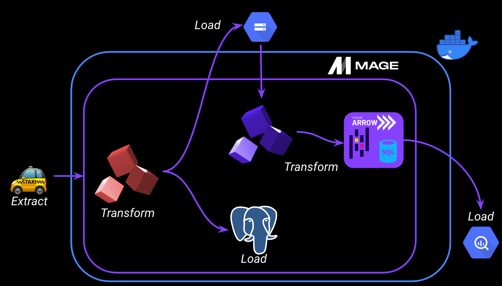
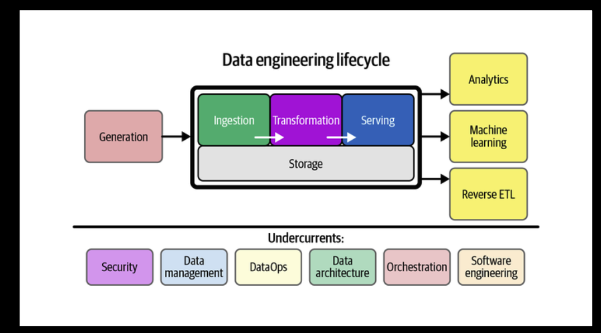
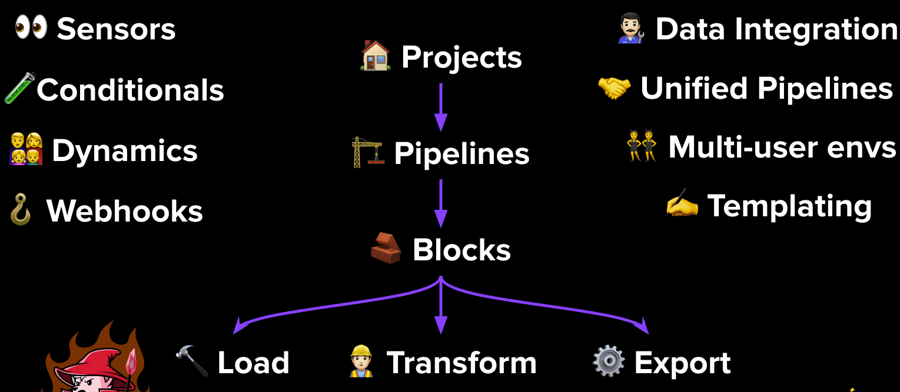
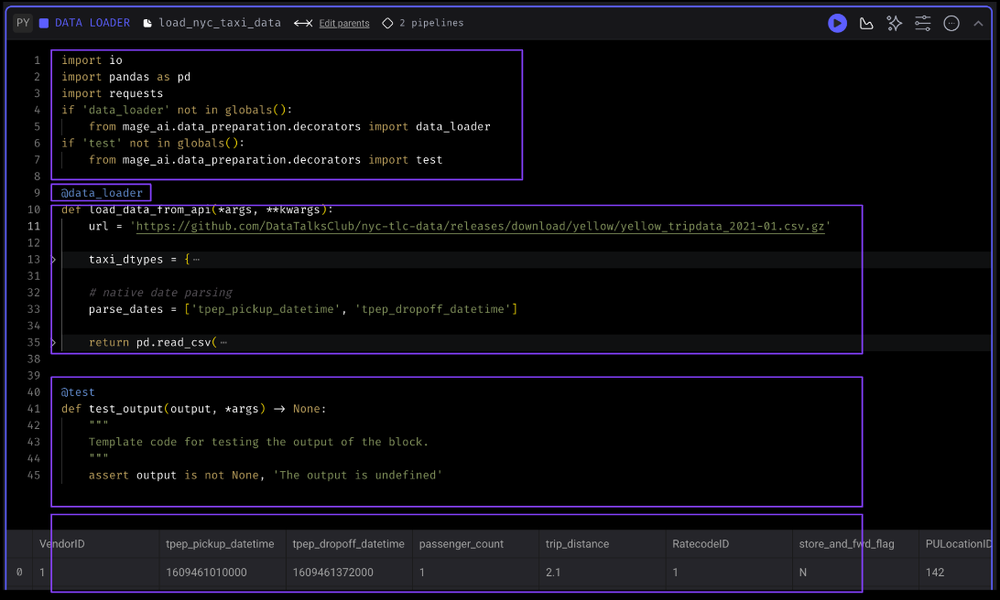

### Contents

- [Intro to Orchestration](#intro-to-orchestration)
    - [What we are going to be building](#what-we-are-going-to-be-building)
    - [What is Orchestration](#what-is-orchestration)
    - [What does a good orchestration tool look like](#what-does-a-good-orchestration-solution-look-like)

# Intro to Orchestration

I.e. how you can orchestrate your data workflows

## What we are going to be building

- Mage and Postgres will run in a docker environment
- Will take the New York yellow can data set > do some transformations on this data 
    - In one stream, we'll load this data to postgres 
    - In the second stream, we'll load it to google cloud storage > perform more transformations using pandas, apache arrow + sql > load this to bigquery  
- In summary:
    - Extracting: pulling data from a source (API - NYC taxi dataset)
    - Transforming: data cleaning, transformation, and partiitioning
    - Loading (API to Mage, Mage to Postgres, GCS & BigQuery)

## What is Orchestration?

- A large part of data engineering is extracting, transforming and loading data between sources > orchestration is a process of dependency management, faciliated through **automation**
- The data orchestrator manages scheduling, triggering, monitoring and even resource allocation

Every workflow requires sequential steps - in which the order of execution needs to be considered (in terms of dependency management)
- In Mage lingo:
    - step = tasks
    - worlfows = DAGS (directed acyclic graphs) - or a pipeline

- top half of the image is essentially ETL
- orchestration is one of the undercurrents i.e. it happens throughout the entire lifecyle; it's key to the entire process fo building DE pipelines

## What does a good orchestration solution look like?

- Handle workflow management - find, schedule, manage workflows; manage dependencies 
- Automation
- Error handling and recovery (e.g. conditional logic, branching, retrying failed tasks)
- Monitoring and alerting
- Resource optimisation 
- Observability - visibility into every part of the pipeline
- Debugging - orchestration tool should allow for easy debugging
- Compliance / Auditing 

A good orchestrator prioritises...

...developer experience:
1. Flow state i.e. no need to context switch / switch between tools
2. Feedback loops - the ability to fail quickly, iterate 
3. Cognitive load 

# Intro to Mage

## What is Mage?

**Mage is an open-source pipeline tool for orchestrating, transforming, and integrating data**

- You can have multiple **projects** within an instance
    - Can think of projects like a GitHub repo - contains all your pipelines, blocks and other assets
- You can have multiple **pipelines** within a project - called DAGS on other platforms
    - A pipeline is a data workflow that executes some data operation e.g. extracting, transforming and loading data from an API
    Each pipeline is represented by a YAML file in the "pipelines" folder of your project
- Each pipeline / DAG is comprised of blocks, which can be written in python, SQL or R
    - A block is a file that can be executed independently of within a pipelien
    - A block won't start running in a pipeline until all its upstream dependencies are met
    - You can use these blocks as testable, reusable, atomic pieces of code
    Changing one block will change it everywhere it's used - but you can easily detach blocks to separate instances if necessary
    - Blocks can be used to perform all sorts of actions, from simple data transformations to complex machine learning models 

### Mage Benefits:

Mage brings further functionality out of the box:
- Sensors - blocks that trigger on some event
- Conditionals - blocks which have conditional logic + if-else logic 
- Dynamics - blocks which can create dynamic children
- Webhooks - for additional functionality

Also have:
- Data integration 
- Unified pipelines - for passing data between your pipelines
- Multi-user envs
- Templating
- Hybrid environment - you can use the GUI for interactive development, or you can just as easily use e.g. VSCode, which will sync back through to the UI

Engineering best-practices **built-in**:
- In-line testing and debugging, in a familiar, notebook-style format
- Fully-featured observability - transformations in one place: dbt models, streaming + more
- DRY principles (Don't Repeat Yourself)

### Anatomy of a Block 

1. Imports
2. Decorator
3. Function - which returns a df
4. Assertion - the test
5. Dataframe - the only thing that is returned the function within the @data_loader block

## Configure Mage