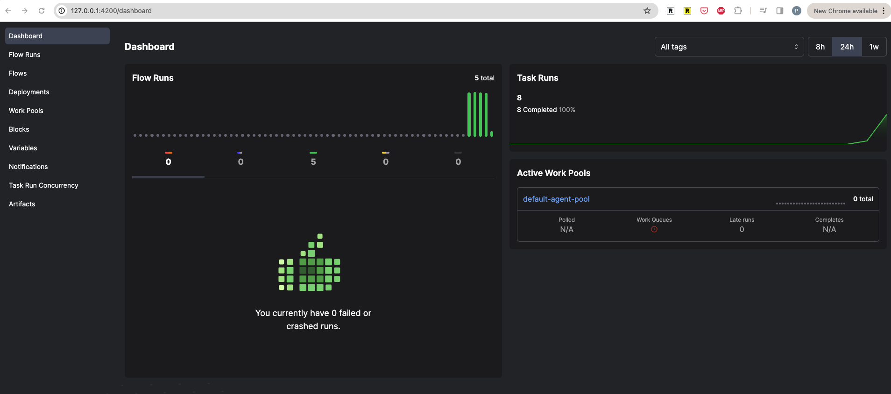
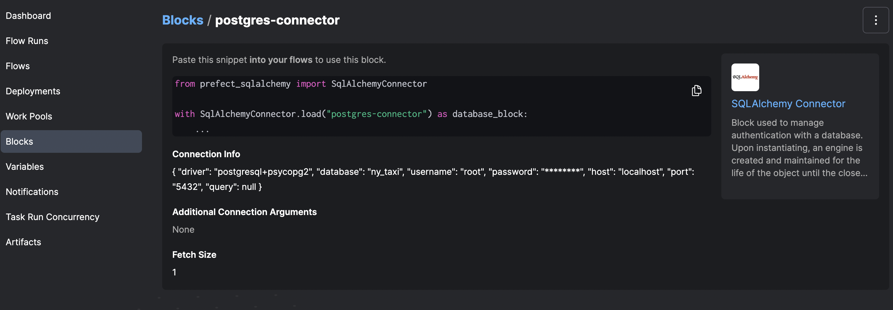
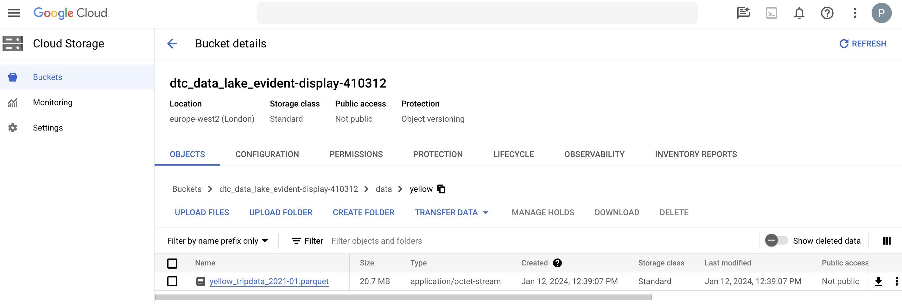
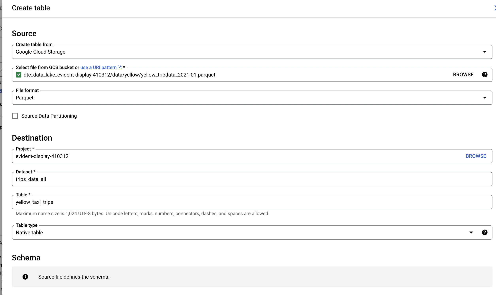
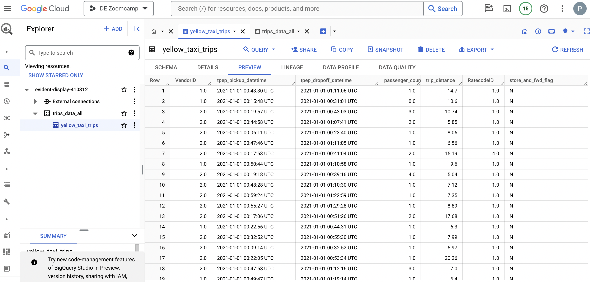

## Table of Conntents

- [Data Lakes](#what-is-a-data-lake)
- [Intro to workflow orchestration](#introduction-to-workflow-orchestration)
    - [Create Venv and Install Dependencies](#create-venv--install-dependencies)
    - [Transform Script into a Prefect Flow](#transform-script-into-a-prefect-flow)
- [ETL with GCP and Prefect](#etl-with-gcp-and-prefect)
- [From Cloud Storage to BigQuery](#from-cloud-storage-to-bigquery)
- [Parameterizing Flows and Deployments](#parameterizing-flows-and-deployments)
- [Schedules and Docker Storage with Infrastructure](#schedules-and-docker-storage-with-infrastructure)
- [Prefect Cloud / Additional Resources](#prefect-cloud--additional-resources)


# What is a Data Lake?

### What is a Data Lake?
A Data Lake consists of a central repository where any type of data, either structured or unstructured, can be stored. The main idea behind a Data Lake is to ingest and make data available as quickly as possible inside an organization.

Generally, when you're storing data into a data lake you will associate some sort of metadata for faster access.

Data Lake solutions should be secure and should scale, and the hardware should be inexpensive (so you can store more dater, more quickly)


### Data Lake vs. Data Warehouse

Data Lake - unstructured data
- Users: data scientists / data analysts
- Use cases - stream processing, machine learning, real time analysis
- In summary: raw data; large amounts of data; undefined

Data Warehouse - structured data
- Users: business analysts
- Use cases - batch processing, BI, reporting
- In summary: refined pre-processed data; smaller volume of data; relational

### Extract-Transform-Load (ETL) vs. Extract-Load-Transform (ELT)
ETL is usually a Data Warehouse solution, used mainly for small amount of data as a schema-on-write approach. On the other hand, ELT is a Data Lake solution, employed for large amounts of data as a schema-on-read approach.

### Data Lake Potential Pitfalls

- Conversion into a data swamp, because:
    - There's no versioning
    - Incompatible schemas for the same data without versioning
    - No associated metadata
    - Joins not possible 

# [Introduction to Workflow orchestration](https://www.youtube.com/watch?v=8oLs6pzHp68&list=PL3MmuxUbc_hJed7dXYoJw8DoCuVHhGEQb&index=17)

### What is a dataflow?

A dataflow defines all extraction and processing steps that the data will be submitted to, also detailing any transformation and intermediate states of the dataset. For example, in an ETL process, a dataset is first extracted (E) from some source (e.g., website, API, etc), then transformed (T) (e.g., dealing with corrupted or missing values, joining datasets, datatype conversion, etc) and finally loaded (L) to some type of storage (e.g., data warehouse). For more details, read [What is Data Flow?](https://www.modernanalyst.com/Careers/InterviewQuestions/tabid/128/ID/6119/What-is-a-Data-Flow.aspx) and [Extract, transform, load](https://en.wikipedia.org/wiki/Extract,_transform,_load).

### What is workflow orchestration?

A workflow orchestration tool allows us to manage and visualize dataflows, while ensuring that they will be run according to a set of predefined rules. A good workflow orchestration tool makes it easy to schedule or execute dataflows remotely, handle faults, integrate with external services, increase reliability, etc. For more information, read [Workflow Orchestration vs. Data Orchestration — Are Those Different?](https://towardsdatascience.com/workflow-orchestration-vs-data-orchestration-are-those-different-a661c46d2e88) and [Your Code Will Fail (but that’s ok)](https://medium.com/the-prefect-blog/your-code-will-fail-but-thats-ok-f0327a208dbe).

### Core Features of a good Workflow Orchestration System

- Remote execution
- Scheduling
- Retries
- Caching
- Integrating with external systems (APIs, databases)
- Ad hoc runs
- Parameterisation
- Alerting you when something fail

# Introduction to Prefect Concepts

## Create Venv + Install Dependencies

Create a python environment in the relevant folder:

```bash
conda create -n zoomcamp python=3.9
conda activate zoomcamp  
```

To leave the environment:

```bash
conda deactivate
```

See requirements.txt for the dependencies

```bash
pip install -r requirements.txt
```

The requirements.txt file:

```requirements.txt
pandas==1.5.2
prefect==2.7.7
prefect-sqlalchemy==0.2.2
prefect-gcp[cloud_storage]==0.2.3
protobuf==4.21.11
pyarrow=10.0.1
pandas-gbq==0.18.1
psycopg2-binary==2.9.5
sqlalchemy=1.4.46
```

## Transform Script into a Prefect Flow


### Step 1

The `ingest_data_wk_2.py` file (see 1.2 `ingest_data.py` file) loads data from a csv into a postgres database (as was shown in more detail in week 1). However, we have to run this script manually - the aim would be to run the script on a schedule without the need to manually trigger it.

So, we need to adapt this script so that it can run on a schedule

### Step 2

- flow -> The most basic python object, a container of workflow logic that allows you to interact with and understand the state of your workflo
- tasks -> Flows can contain tasks. Tasks can receive metadata about upstream dependencies - which gives you the ability to have a task wait on the completion of another task (the dependency) before executing

Transform the script `ingest_data.py` from week 1 (1.2) as follows to create a Prefect flow:

```python
from prefect import flow, task
```

Move all code under ```if __name__ == '__main__``` to a function ```main_flow()```. Then, we use the ```flow``` decorator to indicate that ```main_flow()``` is a Prefect flow. According to the instructor, a flow consists of a container for workflow logic that we can use to interact and understand the state of the workflow. They receive inputs, perform a set of tasks and returns outputs. In addition, we use the ```@task``` decorator to indicate that ```ingest()``` is a task from our flow. See [ingest_data_flow.py](./ingest_data_flow.py). Then, we run this new code:

```python
ingest_data_wk_2.py
```

Output looks something like this: A flow has been created (I commented out the While loop - so only first 1000 row chunk imported into postgres database)

```bash
16:05:11.752 | INFO    | Task run 'ingest_data-0' - Finished in state Completed()
16:05:11.799 | INFO    | Flow run 'radiant-auk' - Finished in state Completed('All states completed.')
```

### Step 3

Transform the script into ETL. Currently, the code performs everything all at once. We can break ```ingest()``` into three different tasks: Extract (E), Transform (T) and Load (L). See [ingest_data_flow_etl.py](../02-workflow-orchestration/ingest_data_flow_etl.py). The output of this ETL script is something like:

In the script - note that you can have subflows (flows held within flows)

```bash
17:09:44.049 | INFO    | Task run 'extract_data-0' - Finished in state Completed()
17:09:44.083 | INFO    | Flow run 'inescapable-prawn' - Created task run 'transform_data-0' for task 'transform_data'
17:09:44.084 | INFO    | Flow run 'inescapable-prawn' - Executing 'transform_data-0' immediately...
17:09:44.165 | INFO    | Task run 'transform_data-0' - pre: missing passenger count: 1973
17:09:44.183 | INFO    | Task run 'transform_data-0' - post: missing passenger count: 0
17:09:44.228 | INFO    | Task run 'transform_data-0' - Finished in state Completed()
17:09:44.267 | INFO    | Flow run 'inescapable-prawn' - Created task run 'ingest_data-0' for task 'ingest_data'
17:09:44.268 | INFO    | Flow run 'inescapable-prawn' - Executing 'ingest_data-0' immediately...
17:09:53.749 | INFO    | Task run 'ingest_data-0' - Finished in state Completed()
17:09:53.797 | INFO    | Flow run 'inescapable-prawn' - Finished in state Completed('All states completed.')
```

Note that now we have the three tasks (extract_data-0, transform_data-0-0, ingest_data-0) instead of a single task (ingest_data-0).
Note that the missing passenger count was 1973, the data is then transformed, and there are no longer any missing passenger rows

### Step 4

Interacting with the Prefect Server - dealing with the UI

To configure Prefect to communicate with the server (run prefect server start to see if the url has changed)

```bash
prefect config set PREFECT_API_URL=http://127.0.0.1:4200/api
```

Then Run:

```bash
prefect server start
```

And then check out the dashboard at http://127.0.0.1:4200

The Prefect Server Dashboard:
- You can also see flow runs etc.



Prefect Orion UI allows us to see our flows in an interactive an intuitive web interface. It summarizes the state of our workflows. Besides, we also have some extra information, such as:

* Task Run Concurrency, which can be configured by adding tags to tasks.

* Notifications, that alerts us when something goes wrong.

* Blocks, which allows us to store configurations and use them as an interface for interacting with external systems. In other words, we can securely store authentication credentials for different services, without the need to specify such credentials directly in our codes or command lines. **[Docs on Blocks](https://docs.prefect.io/latest/concepts/blocks/)**

### Step 5

We want to create a new block for our Postgres connector. In Prefect Server UI, we first click in "Blocks" and then "Add Block +". Next, we add a SQLAlchemyConnector, and fill the corresponding form and click on "Create".
* Block Name -> postgres-connector
* SyncDriver & [postgres+psycopg2](https://docs.sqlalchemy.org/en/14/dialects/postgresql.html#module-sqlalchemy.dialects.postgresql.psycopg2)
* Database -> ny_taxi
* Username -> root
* Password -> root
* Host -> localhost
* port -> 5432



We've pip installed prefect-alchemy as part of our requirements.txt, so we can just add the below code snippet - see the difference between `ingest_data_flow_etl.py` and `ingest_data_flow_etl_with_sql_block.py` (the difference is in the load_data() function - with some v small changes to accomodate these changes elsewhere). It means we don't have to hard code the user, password, host, port or db anymore:

```python
from prefect_sqlalchemy import SqlAlchemyConnector

with SqlAlchemyConnector.load("postgres-connector") as database_block:
    ...
```

Here is the output. You'll also see 2 new flow runs (the 'Ingest Flow' and the 'Subflow' in the Prefect Server UI):


```bash
18:07:35.586 | INFO    | prefect.engine - Created flow run 'heavy-jacamar' for flow 'Ingest flow'
18:07:35.588 | INFO    | Flow run 'heavy-jacamar' - View at http://127.0.0.1:4200/flow-runs/flow-run/f02329d7-6ec3-43cb-9eb5-e2ecc24bb554
18:07:35.876 | INFO    | Flow run 'heavy-jacamar' - Created subflow run 'beautiful-macaw' for flow 'Subflow'
18:07:35.878 | INFO    | Flow run 'beautiful-macaw' - View at http://127.0.0.1:4200/flow-runs/flow-run/68e1afec-c92b-431a-a7d1-0c6371692851
18:07:35.990 | INFO    | Flow run 'beautiful-macaw' - Logging Subflow for: wk_2_yellow_taxi_trips
18:07:36.063 | INFO    | Flow run 'beautiful-macaw' - Finished in state Completed()
18:07:36.107 | INFO    | Flow run 'heavy-jacamar' - Created task run 'extract_data-0' for task 'extract_data'
18:07:36.109 | INFO    | Flow run 'heavy-jacamar' - Executing 'extract_data-0' immediately...
18:07:36.189 | INFO    | Task run 'extract_data-0' - Finished in state Cached(type=COMPLETED)
18:07:36.850 | INFO    | Flow run 'heavy-jacamar' - Created task run 'transform_data-0' for task 'transform_data'
18:07:36.851 | INFO    | Flow run 'heavy-jacamar' - Executing 'transform_data-0' immediately...
18:07:36.944 | INFO    | Task run 'transform_data-0' - pre: missing passenger count: 1973
18:07:36.965 | INFO    | Task run 'transform_data-0' - post: missing passenger count: 0
18:07:37.015 | INFO    | Task run 'transform_data-0' - Finished in state Completed()
18:07:37.055 | INFO    | Flow run 'heavy-jacamar' - Created task run 'load_data-0' for task 'load_data'
18:07:37.056 | INFO    | Flow run 'heavy-jacamar' - Executing 'load_data-0' immediately...
18:07:37.280 | INFO    | Task run 'load_data-0' - Created a new engine.
18:07:37.297 | INFO    | Task run 'load_data-0' - Created a new connection.
18:07:46.999 | INFO    | Task run 'load_data-0' - Finished in state Completed()
18:07:47.049 | INFO    | Flow run 'heavy-jacamar' - Finished in state Completed('All states completed.')
```


# ETL with GCP and Prefect

### Step 1

 write an ETL script for saving data locally and uploading it to GCP (see [etl_web_to_gcs.py](../02-workflow-orchestration/02_gcp/etl_web_to_gcs.py)).

### Step 2

Create a bucket in GCP. Can use Terraform for this - remember to set GOOGLE_APPLICATION_CREDENTIALS to location of authentication key JSON file.

Bucket created called: dtc_data_lake_evident-display-410312

### Step 3

Run Prefect Server UI from the terminal.

```
prefect server start
```

### Step 3

Create a Prefect Block to store our GCP credentials (for generating GCP credentials, see `DE Zoomcamp 1.3.1 - Introduction to Terraform Concepts & GCP Pre-Requisites`), because blocks allow us to reuse configuration with external services, doing it in a secure way.

In the Prefect Orion UI click on "Blocks" and then find the GCS Bucket Block.

Important note: if GCS Bucket is not available, go to the terminal and run:

```bash
prefect block register -m prefect_gcp
```
* This should create a GCS Bucket Block and a GCP Credentials Block

### Step 4

Configure a GCS Bucket Block and a GCP Credentials Block:

**GCS Bucket Block**:
- Block Name: zoomcamp-gcs
- Bucket (*add the name of the gcs bucket here*): dtc_data_lake_evident-display-410312
- Select/Create credentials block (see below)
    - So the block is created within the GCS Bucket block
- Hit Create
- You then get this code snippet (with the caption: Paste this snippet into your flows to use this block.)
    from prefect_gcp.cloud_storage import GcsBucket
    gcp_cloud_storage_bucket_block = GcsBucket.load("zoomcamp-gcs")

**GCP Credentials Block**:
- Block Name: zoomcamp-gcp-credentials
- Service Account File: /home/USERNAME/.gc/evident-display-410312-6d17d29a1ecf.json
    - I chose to use the path of the json file that stores my credentials. Could also have pasted the contents directly in the blue box under "The contents of the keyfile as dict".


### Step 5

Running `etl_web_to_gcs.py` file where the `write_gcs()` function makes use of the blocks we've created:

```python
@task()
def write_gcs(path: Path) -> None:
    """Uploading local parquet file to GCS"""
    gcs_block = GcsBucket.load("zooomcamp-gcs")
    gcs_block.upload_from_path(
        from_path=path,
        to_path=path
    )
    return
```

### Step 6

Check the uploaded data in GCP - it's now in our data lake 



# From Cloud Storage to BigQuery

### Step 1

Implement ETL script to extract data from GCS, transform and load it into BigQuery. See [etl_gcs_to_bq.py](../02-workflow-orchestration/02_gcp/etl_gcs_to_bq.py), and especially the function ```write_to_bq``` (note that we are going to use the GcpCredentials that we have just created in the previous section).

### Step 2

Create a table in BigQuery. In my project, I already have a dataset named trips_data_all, which was created using Terraform. For such, in the explorer menu click on the three dots and choose "Create table":


Then fill in the form to create a table using the data we loaded into our bucket



The table is loaded in, with a schema prepopulated with the columns from the parquet file of taxi rides.

### Step 3

Deleted all the rows from this table so that we can test the script from Step 1. The SQL query is as follows:

```sql
DELETE FROM `evident-display-410312.trips_data_all.yellow_taxi_trips` WHERE TRUE;
```

### Step 4 

Run etl_gcs_to_bq.py and check that the data is in the BigQuery table (by clicking on our table in BQ and clicking preview)

```python
python etl_gcs_to_bq.py
```

### Step 5

Now if we select our table in BgQuery and hit Preview, data from the parquet file has been loaded into the table



# Parameterizing Flows and Deployments

### Step 1

We've reimplemented the `etl_web_to_gcs.py` as `parameterized_flow.py`, adding parameters to the `etl_web_to_gcs()` function and adding a parent flow so that the `etl_web_to_gcs()` flow runs for each specified month in the months parameter. Results can be seen in the GCS bucket.


### N.b. Deployments

N.b. make sure the Prefect Server is running as you do the following steps (```prefect server start```  in the terminal)

**[deployment docs](https://docs.prefect.io/latest/concepts/deployments/#deployments-overview)**

Deploying a flow to Prefect provides it with a Deployment Definition - Prefect will know if e.g. it runs on a schedule; it needs to be run with certain infrastructure like Kubernetes, or Docker; maybe the flow code isn't stored locally anymore (but e.g. on Docker, Github) and so needs to be deployed to Prefect.

You can multiple deployments for a single flow:
* Now that our flow code is parameterized, one flow may be deployed for the color "green", or for the months 8, 9, 10, etc.

### Step 2

So far, we've run our scripts from the terminal. We want to know deploy the workflow using Prefect in order to avoid the need to trigger the workflow manually. In the terminal, we run the command shown below, which outputs a YAML file containing the workflow's deployment metadata.
- You can also create a deployment using Python (see future video)

```bash
prefect deployment build ./parameterized_flow.py:etl_parent_flow -n "Parameterized ETL"
```
* parameterized_flow -> the file name
* etl_parent_flow -> the entry point to the flow
* "Parameterized ETL" -> the deployment name

The output deployment apply etl_parent_flow-deployment.yaml file:

```yaml
###
### A complete description of a Prefect Deployment for flow 'etl-parent-flow'
###
name: Parameterized ETL
description: null
version: 261cf127093cccb2e0f4fca5892dd9e2
# The work queue that will handle this deployment's runs
work_queue_name: default
work_pool_name: null
tags: []
parameters: { "color": "yellow", "months": [1, 2, 3], "year": 2021 }
schedule: null
is_schedule_active: null
infra_overrides: {}
infrastructure:
  type: process
  env: {}
  labels: {}
  name: null
  command: null
  stream_output: true
  working_dir: null
  block_type_slug: process
  _block_type_slug: process

###
### DO NOT EDIT BELOW THIS LINE
###
flow_name: etl-parent-flow
manifest_path: null
storage: null
path: /home/USERNAME/de-zoomcamp/02-workflow-orchestration/02_gcp
entrypoint: parameterized_flow.py:etl_parent_flow
parameter_openapi_schema:
  title: Parameters
  type: object
  properties:
    months:
      title: months
      default:
      - 1
      - 2
      position: 0
      type: array
      items:
        type: integer
    year:
      title: year
      default: 2021
      position: 1
      type: integer
    color:
      title: color
      default: yellow
      position: 2
      type: string
  required: null
  definitions: null
timestamp: '2024-01-15T14:23:56.779664+00:00'
triggers: []
```

### Step 3

Can see that in the above .yaml file the parameters are empty in the description of the Prefect Deployment (as we didn't pass any parameters in when we built the deployment)

We can edit the metadata in this .yaml file to add the parameters we want (can also change the parameters in the prefect server UI)

```yaml
parameters : { "color": "yellow", "months": [1, 2, 3], "year": 2021 }
```

### Step 4

Create the deployment on the API

```bash
prefect deployment apply etl_parent_flow-deployment.yaml
```

You can now see the deployment in the Prefect Server UI


### Step 5

Trigger a quick run from the UI


### Step 6

After triggering a quick run, the deployment will show as "Scheduled" (and then "Late"). To deploy this workflow for execution, we need an agent.

Agents consist of lightweight Python processes in our execution environment. They pick up scheduled workflow runs from Work Queues (found within Work Pools on the UI).

Work Queues coordinate many deployments with many agents by collecting scheduled workflow runs for deployment according to some filtering criteria.

Some nice references for better understanding the roles of Agents and Work Queues are: [Agents and Work Queues (Prefect docs)](https://docs.prefect.io/concepts/work-queues/) and [What’s the role of agents and work queues, and how the concept of agents differ between Prefect 1.0 and 2.0?](https://discourse.prefect.io/t/whats-the-role-of-agents-and-work-queues-and-how-the-concept-of-agents-differ-between-prefect-1-0-and-2-0/689)

We launch an agent with the following command. The agent will automatically run our scheduled workflow.
```
prefect agent start --pool "default-agent-pool" --work-queue "default"
```

### Step 7

Setting up Notifications for these runs - now that we can trigger flow runs via deployments rather than manually.

In the UI, go to the Notification tab, and you can set up a notification based on various criteria.

There are a couple of other ways you can set up notifications:
* Via a collection - you can include it in your code after you've imported the relevant collection
* Using blocks

# Schedules and Docker Storage with Infrastructure

## Scheduling Flows

In the Prefect Server UI, there is a scheduling option for deployments.

After scheduling, our workflow will be run according to our rule as long as we have an agent to pick it up + a Prefect Server serving it (or use prefect cloud, which is always running - just need an agent in that case). Alternatively, we can also use the set the --cron parameter during deployment.

```bash
prefect deployment build parameterized_flow.py:etl_parent_flow -n etl2 --cron "0 0 * * *" -a
```

The result of the command above is shown in the figure below ("At 12:00 AM every day").

## Running Flows in Docker Containers 

Currently have our code sitting locally - to make it more production ready, so that other people can access it, we could put it on github on another version control website, or we could store our code in a Docker image and put it up on Docker Hub. 
* Then when we run a docker container, the code will be accessible

### Step 1

Create a Dockerfile for our workflow - with a docker-requirements.txt file to specify the packages to be installed.

```Dockerfile
FROM prefecthq/prefect:2.7.7-python3.9

COPY docker-requirements.txt .

RUN pip install -r docker-requirements.txt --trusted-host pypi.python.org --no-cache-dir

COPY 03_deployments/parameterized_flow.py /opt/prefect/03_deployments/parameterized_flow.py
COPY 03_deployments/data /opt/prefect/03_deployments/data
```

### Step 2

Then login to DockerHub, create an image repository, and finally push the image. In the commands, change "PGrimshaw10" to your DockerHub username.

```bash
docker image build -t pgrimshaw10/prefect:zoom .

docker login

docker image push pgrimshaw10/prefect:zoom
```
* zoom - just a tag for the image, can I think name this anything

Docker image is now in my Docker hub: anyone can access it there


### Step 3

Create a Docker Container infrastructure block in Prefect
- Called zoomcamp
- Image -> pgrimshaw10/prefect:zoom
- ImagePullPolicy -> ALWAYS
- Auto Remove -> Toggle on
- Stream Output -> keep toggled on

Can also use code to make a docker block - see below:

```python
from prefect.infrastructure.docker import DockerContainer

# alternative to creating DockerContainer block in the UI
docker_block = DockerContainer(
    image="discdiver/prefect:zoom",  # insert your image here
    image_pull_policy="ALWAYS",
    auto_remove=True,
)

docker_block.save("zoomcamp", overwrite=True)
```

### Step 4

Create a deployment - using a python file rather than the UI this time - `docker_deploy.py`

Run the following command:

```bash
python docker_deploy.py
```

Deployment will now show in the prefect UI deployments tab

```bash
prefect config set PREFECT_API_URL=http://127.0.0.1:4200/api # so docker container able to interface with Prefect Server

prefect agent start -q default

prefect deployment run etl-parent-flow/docker-flow -p "months=[1,2]"
```

The results now show in our GCS bucket:


### 2 Problems encountered while Deploying / Running Flow in Docker Container

**Problem 1**

**Problem #1:**

    ...
    ValueError: Path /home/pgrimshaw10/.prefect/storage/c3ec11659da6459f8cfafe36de0bcaab does not exist.

    Finished in state Failed('Flow run encountered an exception. ValueError: Path /home/prgrimshaw10/.prefect/storage/c3ec11659da6459f8cfafe36de0bcaab does not exist.\n')

The above is related to the task caching parameters that we set in the function ```fetch``` in 'parameterized_flow.py'. The easiest solution to this problem is to remove ```cache_key_fn``` and ```cache_expiration``` parameters. See this [issue in GitHub](https://github.com/PrefectHQ/prefect/issues/6086).

**Problem #2:**

    ...
    pydantic.error_wrappers.ValidationError: 1 validation error for GcsBucket gcp_credentials -> service_account_file
    The provided path to the service account is invalid (type=value_error)

    The above exception was the direct cause of the following exception:
    ...
    RuntimeError: Unable to load 'zoomcamp-gcs' of block type None due to failed validation. To load without validation, try loading again with `validate=False`.

When creating the GCS Bucket block, I used a "Service Account File" to set the value of the GCP Credentials block. However, this JSON file can't be found by Prefect in the Docker container (as it's stored locally). So, instead of using a service account file when configuring the block, copy and paste the contents from the JSON file into th 'Service Account Info' section as a dict.

# Prefect Cloud / Additional Resources

[Link the the video](https://youtu.be/gGC23ZK7lr8)

* [Prefect Docs](https://docs.prefect.io/)
* [Prefect Cloud](https://www.prefect.io/cloud/)
    * There is a free hosted cloud that you can use - instead of using the local prefect server
* [Anna Geller's GitHub](https://github.com/anna-geller)
* [Prefect Community](https://discourse.prefect.io/)

