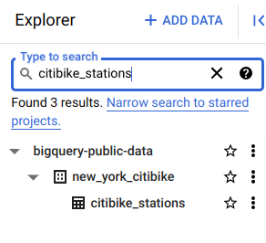
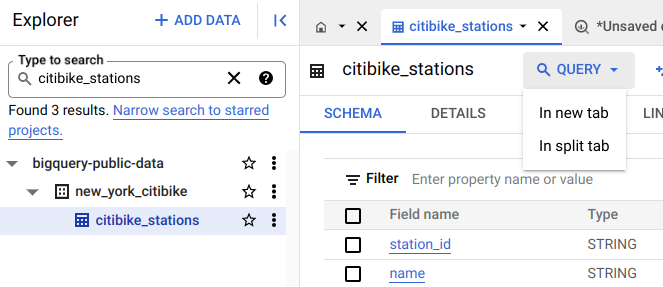
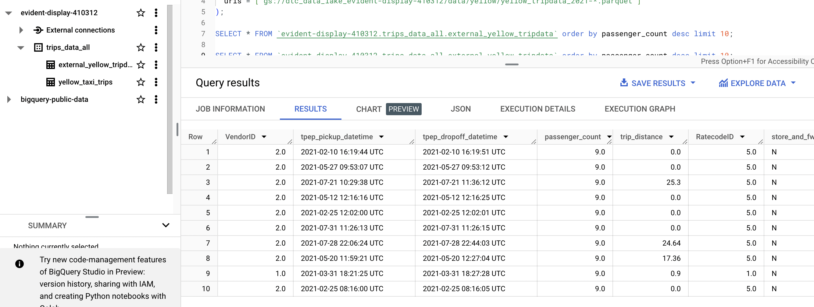

### Table of contents

- [OLAP v OLTP](#olap-vs-oltp)
- [What is a Data Warehouse?](#what-is-a-data-warehouse)

# OLAP vs OLTP

In Data Science, when we're discussing data processing systems, there are 2 main types: **OLAP** and **OLTP** systems.

* ***OLTP***: Online Transaction Processing.
* ***OLAP***: Online Analytical Processing.

An intuitive way of looking at both of these systems is that OLTP systems are "classic databases" whereas OLAP systems are catered for advanced data analytics purposes.

|   | OLTP | OLAP |
|---|---|---|
| Purpose | Control and run essential business operations in real time | Plan, solve problems, support decisions, discover hidden insights |
| Data updates | Short, fast updates initiated by user | Data periodically refreshed with scheduled, long-running batch jobs |
| Database design | Normalized databases for efficiency | Denormalized databases for analysis |
| Space requirements | Generally small if historical data is archived | Generally large due to aggregating large datasets |
| Backup and recovery | Regular backups required to ensure business continuity and meet legal and governance requirements | Lost data can be reloaded from OLTP database as needed in lieu of regular backups |
| Productivity | Increases productivity of end users | Increases productivity of business managers, data analysts and executives |
| Data view | Lists day-to-day business transactions | Multi-dimensional view of enterprise data |
| User examples | Customer-facing personnel, clerks, online shoppers | Knowledge workers such as data analysts, business analysts and executives |

# What is a Data Warehouse?

A **Data Warehouse** (DW) is an ***OLAP solution*** meant for ***reporting and data analysis***. Unlike Data Lakes, which follow the ELT model, DWs commonly use the ETL model (rather than ELT)

A DW receives data from different ***data sources*** which is then processed in a ***staging area*** before being ingested to the actual warehouse (a database) and arranged as needed. DWs may then feed data to separate ***Data Marts***; smaller database systems which end users may use for different purposes.

# BigQuery

BigQuery (BQ) is a Data Warehouse solution offered by Google Cloud Platform.
* BQ is ***serverless***. There are no servers to manage or database software to install; this is managed by Google and it's transparent to the customers.
* BQ is ***scalable*** and has ***high availability***. Google takes care of the underlying software and infrastructure.
* BQ has built-in features like Machine Learning, Geospatial Analysis and Business Intelligence among others.
* BQ maximizes flexibility by separating data analysis and storage in different _compute engines_, thus allowing the customers to budget accordingly and reduce costs.

Some alternatives to BigQuery from other cloud providers would be AWS Redshift or Azure Synapse Analytics.

## Pricing

BigQuery pricing is divided in 2 main components: processing and storage. There are also additional charges for other operations such as ingestion or extraction. The cost of storage is fixed and at the time of writing is US$0.02 per GB per month; you may check the current storage pricing [in this link](https://cloud.google.com/bigquery/pricing#storage).

Data processing has a [2-tier pricing model](https://cloud.google.com/bigquery/pricing#analysis_pricing_models):
*  On demand pricing (default): US$5 per TB per month; the first TB of the month is free.
*  Flat rate pricing: based on the number of pre-requested _slots_ (virtual CPUs).
   *  A minimum of 100 slots is required for the flat-rate pricing which costs US$2,000 per month.
   *  Queries take up slots. If you're running multiple queries and run out of slots, the additional queries must wait until other queries finish in order to free up the slot. On demand pricing does not have this issue.
   *  The flat-rate pricing only makes sense when processing more than 400TB of data per month.
  
When running queries on BQ, the top-right corner of the window will display an approximation of the size of the data that will be processed by the query. Once the query has run, the actual amount of processed data will appear in the _Query results_ panel in the lower half of the window. This can be useful to quickly calculate the cost of the query.

## Open Source Data

BigQuery provides a lot of open source data e.g. we can search for the citibikes_station data (click search all projects) from the bigquery-public-data project:



You can then preview the data and query it:



The query tab will have this code prepopulated:

```sql
SELECT  FROM `bigquery-public-data.new_york_citibike.citibike_stations` LIMIT 1000
```
- With the SELECT left blank

## External Tables

BigQuery supports a few [_external data sources_](https://cloud.google.com/bigquery/external-data-sources): you may query these sources directly from BigQuery even though the data itself isn't stored in BQ.

An ***external table*** is a table that acts like a standard BQ table. The table metadata (such as the schema) is stored in BQ storage but the data itself is external.

You may create an external table from a CSV or Parquet file stored in a Cloud Storage bucket:

Here, we create an external table for our yellow taxi trips data. `evident-display-410312` is the id of my project, `trips_data_all` is the name of my BQ database and `external_yellow_tripdata` is the name of the external table that we are creating.
- I had 7 files in my `dtc_data_lake_evident-display-410312` bucket (months 1-7 of 2021) - all with the same structure apart from the month at the end e.g. yellow_tripdata_2021-01.parquet
- The star means that all 12 files are picked up 


```sql
CREATE OR REPLACE EXTERNAL TABLE `evident-display-410312.trips_data_all.external_yellow_tripdata`
OPTIONS (
  format = 'PARQUET',
  uris = ['gs://dtc_data_lake_evident-display-410312/data/yellow/yellow_tripdata_2021-*.parquet']
);
```


```sql
SELECT * FROM `evident-display-410312.trips_data_all.external_yellow_tripdata` order by passenger_count desc limit 100;
```
- From this example query, you can see results from different months have been uploaded to the external table - the CREATE OR REPLACE EXTERNAL TABLE function has pulled the data from all 7 files in the bucket, and because each file has the same schema, one external table has been created



You can import an external table into BQ as a normal table by copying the contents of the external table to a new internal table

```sql
CREATE OR REPLACE TABLE taxi-rides-ny.nytaxi.yellow_tripdata_non_partitoned AS
SELECT * FROM taxi-rides-ny.nytaxi.external_yellow_tripdata;
```


