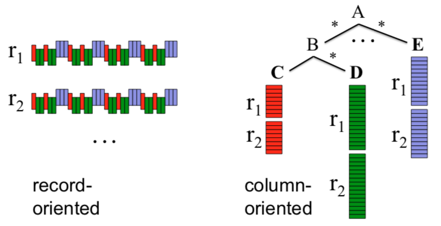
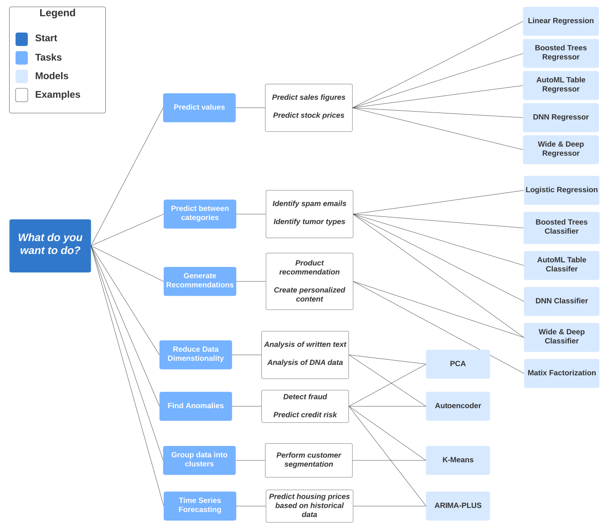
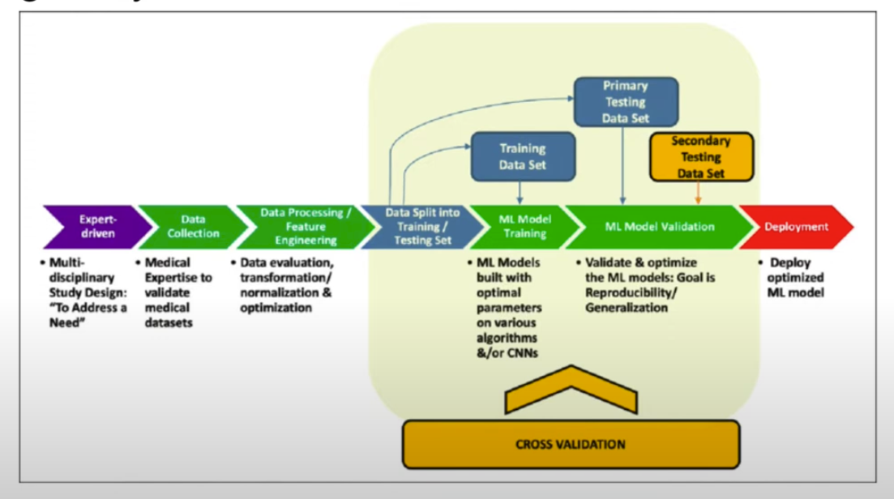
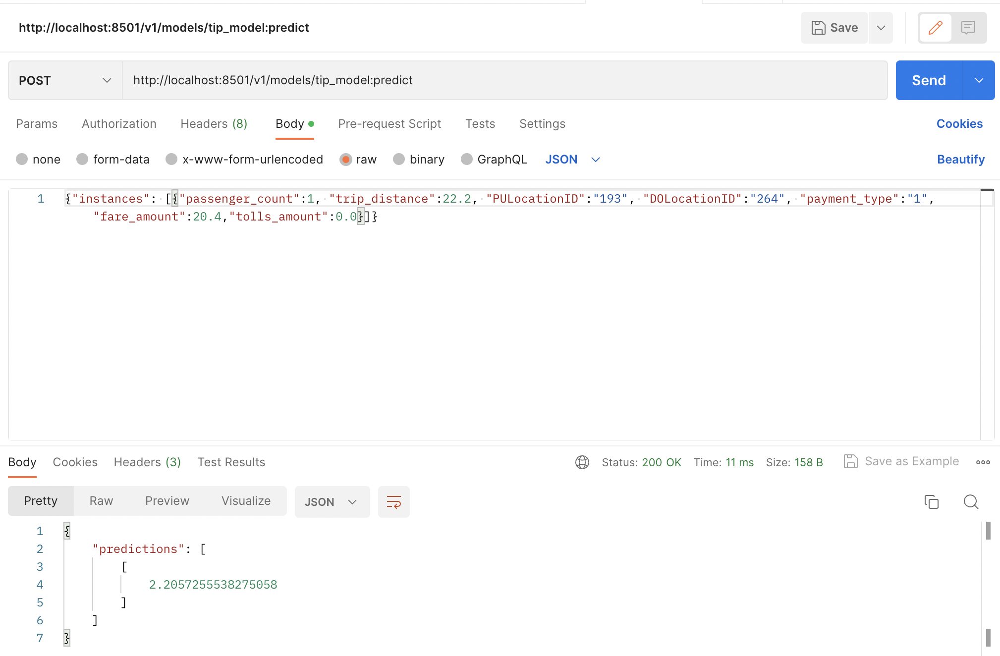

### Table of contents

- [OLAP v OLTP](#olap-vs-oltp)
- [What is a Data Warehouse?](#what-is-a-data-warehouse)
- [Bigquery](#bigquery)
  - [Pricing](#pricing)
  - [External tables](#external-tables)
  - [Partitions](#partitions)
  - [Clustering](#clustering)
  - [Partitioning vs Clustering](#partitioning-v-clustering)
  - [Best practices](#best-practices)
  - [Internals](#bigquery-internals)
    - [BigQuery Architecture](#bigquery-architecture)
    - [Column-oriented vs record-oriented storage](#column-oriented-vs-record-oriented-storage)
- [Machine Learning in BigQuery](#machine-learning-in-bigquery)    
  - [Intro to BigQuery ML](#intro-to-bigquery-ml)
  - [BigQuery ML Deployment](#bigquery-ml-deployment)


# OLAP vs OLTP

In Data Science, when we're discussing data processing systems, there are 2 main types: **OLAP** and **OLTP** systems.

* ***OLTP***: Online Transaction Processing.
* ***OLAP***: Online Analytical Processing.

An intuitive way of looking at both of these systems is that OLTP systems are "classic databases" whereas OLAP systems are catered for advanced data analytics purposes.

|   | OLTP | OLAP |
|---|---|---|
| Purpose | Control and run essential business operations in real time | Plan, solve problems, support decisions, discover hidden insights |
| Data updates | Short, fast updates initiated by user | Data periodically refreshed with scheduled, long-running batch jobs |
| Database design | Normalized databases for efficiency | Denormalized databases for analysis |
| Space requirements | Generally small if historical data is archived | Generally large due to aggregating large datasets |
| Backup and recovery | Regular backups required to ensure business continuity and meet legal and governance requirements | Lost data can be reloaded from OLTP database as needed in lieu of regular backups |
| Productivity | Increases productivity of end users | Increases productivity of business managers, data analysts and executives |
| Data view | Lists day-to-day business transactions | Multi-dimensional view of enterprise data |
| User examples | Customer-facing personnel, clerks, online shoppers | Knowledge workers such as data analysts, business analysts and executives |

# What is a Data Warehouse?

A **Data Warehouse** (DW) is an ***OLAP solution*** meant for ***reporting and data analysis***. Unlike Data Lakes, which follow the ELT model, DWs commonly use the ETL model (rather than ELT)

A DW receives data from different ***data sources*** which is then processed in a ***staging area*** before being ingested to the actual warehouse (a database) and arranged as needed. DWs may then feed data to separate ***Data Marts***; smaller database systems which end users may use for different purposes.

# BigQuery

BigQuery (BQ) is a Data Warehouse solution offered by Google Cloud Platform.
* BQ is ***serverless***. There are no servers to manage or database software to install; this is managed by Google and it's transparent to the customers.
* BQ is ***scalable*** and has ***high availability***. Google takes care of the underlying software and infrastructure.
* BQ has built-in features like Machine Learning, Geospatial Analysis and Business Intelligence among others.
* BQ maximizes flexibility by separating data analysis and storage in different _compute engines_, thus allowing the customers to budget accordingly and reduce costs.

Some alternatives to BigQuery from other cloud providers would be AWS Redshift or Azure Synapse Analytics.

## Pricing

BigQuery pricing is divided in 2 main components: processing and storage. There are also additional charges for other operations such as ingestion or extraction. The cost of storage is fixed and at the time of writing is US$0.02 per GB per month; you may check the current storage pricing [in this link](https://cloud.google.com/bigquery/pricing#storage).

Data processing has a [2-tier pricing model](https://cloud.google.com/bigquery/pricing#analysis_pricing_models):
*  On demand pricing (default): US$5 per TB per month; the first TB of the month is free.
*  Flat rate pricing: based on the number of pre-requested _slots_ (virtual CPUs).
   *  A minimum of 100 slots is required for the flat-rate pricing which costs US$2,000 per month.
   *  Queries take up slots. If you're running multiple queries and run out of slots, the additional queries must wait until other queries finish in order to free up the slot. On demand pricing does not have this issue.
   *  The flat-rate pricing only makes sense when processing more than 400TB of data per month.
  
When running queries on BQ, the top-right corner of the window will display an approximation of the size of the data that will be processed by the query. Once the query has run, the actual amount of processed data will appear in the _Query results_ panel in the lower half of the window. This can be useful to quickly calculate the cost of the query.

## Open Source Data

BigQuery provides a lot of open source data e.g. we can search for the citibikes_station data (click search all projects) from the bigquery-public-data project:


You can then preview the data and query it:


The query tab will have this code prepopulated:

```sql
SELECT  FROM `bigquery-public-data.new_york_citibike.citibike_stations` LIMIT 1000
```
- With the SELECT left blank

## External Tables

BigQuery supports a few [_external data sources_](https://cloud.google.com/bigquery/external-data-sources): you may query these sources directly from BigQuery even though the data itself isn't stored in BQ.

An ***external table*** is a table that acts like a standard BQ table. The table metadata (such as the schema) is stored in BQ storage but the data itself is external.

You may create an external table from a CSV or Parquet file stored in a Cloud Storage bucket:

Here, we create an external table for our yellow taxi trips data. `evident-display-410312` is the id of my project, `trips_data_all` is the name of my BQ database and `external_yellow_tripdata` is the name of the external table that we are creating.
- I had 7 files in my `dtc_data_lake_evident-display-410312` bucket (months 1-7 of 2021) - all with the same structure apart from the month at the end e.g. yellow_tripdata_2021-01.parquet
- The star means that all 12 files are picked up 


```sql
CREATE OR REPLACE EXTERNAL TABLE `evident-display-410312.trips_data_all.external_yellow_tripdata`
OPTIONS (
  format = 'PARQUET',
  uris = ['gs://dtc_data_lake_evident-display-410312/data/yellow/yellow_tripdata_2021-*.parquet']
);
```


```sql
SELECT * FROM `evident-display-410312.trips_data_all.external_yellow_tripdata` order by passenger_count desc limit 100;
```
- From this example query, you can see results from different months have been uploaded to the external table - the CREATE OR REPLACE EXTERNAL TABLE function has pulled the data from all 7 files in the bucket, and because each file has the same schema, one external table has been created


You can import an external table into BQ as a normal table by copying the contents of the external table to a new internal table

```sql
CREATE OR REPLACE TABLE evident-display-410312.trips_data_all.yellow_tripdata_non_partitoned AS
SELECT * FROM evident-display-410312.trips_data_all.external_yellow_tripdata;
```

## Partitions

BQ tables can be ***partitioned*** into multiple smaller tables. E.g. if we often filter queries based on date, we could partition a table based on date so that we only query a specific sub-table based on the date we're interested in.

[Partition tables](https://cloud.google.com/bigquery/docs/partitioned-tables) are very useful to improve performance and reduce costs, because BQ will not process as much data per query.

You may partition a table by:
* ***Time-unit column***: partition based on a `TIMESTAMP`, `DATE`, or `DATETIME` column in the table. When you write data to the table, BQ will automatically put data into the correct partition
* ***Ingestion time***: partition based on the timestamp when BigQuery ingests the data.
* ***Integer range***: tables are partitioned based on an integer column.

For Time-unit and Ingestion time columns, the partition may be daily (the default option), hourly, monthly or yearly.

>Note: BigQuery limits the amount of partitions to 4000 per table. If you need more partitions, consider [clustering](#clustering) as well.

Here's an example query for creating a partitioned table:

```sql
CREATE OR REPLACE TABLE evident-display-410312.trips_data_all.yellow_tripdata_partitoned
PARTITION BY
  DATE(tpep_pickup_datetime) AS
SELECT * FROM evident-display-410312.trips_data_all.external_yellow_tripdata;
```

BQ will identify partitioned tables with a specific icon. The _Details_ tab of the table will specify the field which was used for partitioning the table and its datatype.

Querying a partitioned table is identical to querying a non-partitioned table, but the amount of processed data may be drastically different. Here are 2 identical queries to the non-partitioned and partitioned tables we created in the previous queries:

```sql
SELECT DISTINCT(VendorID)
FROM evident-display-410312.trips_data_all.yellow_tripdata_non_partitoned
WHERE DATE(tpep_pickup_datetime) BETWEEN '2021-06-01' AND '2021-06-30';
```
* Query to non-partitioned table.
* It will process around 1.6GB of data/

```sql
SELECT DISTINCT(VendorID)
FROM evident-display-410312.trips_data_all.yellow_tripdata_partitoned
WHERE DATE(tpep_pickup_datetime) BETWEEN '2021-06-01' AND '2021-06-30';
```
* Query to partitioned table.
* It will process around 42.3MB of data.

You may check the amount of rows of each partition in a partitioned table with a query such as this:

```sql
SELECT table_name, partition_id, total_rows
FROM `trips_data_all.INFORMATION_SCHEMA.PARTITIONS`
WHERE table_name = 'yellow_tripdata_partitoned'
ORDER BY total_rows DESC;
```
- 50 partitions with between 90k and 105k rows in each partition 

This is useful to check if there are data imbalances and/or biases in your partitions.

## Clustering 

***Clustering*** consists of rearranging a table based on the values of its columns so that the table is ordered according to any criteria. Clustering can be done based on one or multiple columns up to 4; the ***order*** of the columns in which the clustering is specified is important in order to determine the column priority.

Clustering may improve performance and lower costs on big datasets for certain types of queries, such as queries that use filter clauses and queries that aggregate data.

>Note: tables with less than 1GB don't show significant improvement with partitioning and clustering; doing so in a small table could even lead to increased cost due to the additional metadata reads and maintenance needed for these features (though clustering is preferred to partitioning for smaller tables)

Clustering columns must be ***top-level***, ***non-repeated*** columns. The following datatypes are supported:
* `DATE`
* `BOOL`
* `GEOGRAPHY`
* `INT64`
* `NUMERIC`
* `BIGNUMERIC`
* `STRING`
* `TIMESTAMP`
* `DATETIME`

A partitioned table can also be clustered. Here's an example query for creating a partitioned and clustered table:

```sql
CREATE OR REPLACE TABLE evident-display-410312.trips_data_all.yellow_tripdata_partitoned_clustered
PARTITION BY DATE(tpep_pickup_datetime)
CLUSTER BY VendorID AS
SELECT * FROM evident-display-410312.trips_data_all.external_yellow_tripdata;
```

Just like for partitioned tables, the _Details_ tab for the table will also display the fields by which the table is clustered.

Here are 2 identical queries, one for a partitioned table and the other for a partitioned and clustered table:

```sql
SELECT count(*) as trips
FROM evident-display-410312.trips_data_all.yellow_tripdata_partitoned
WHERE DATE(tpep_pickup_datetime) BETWEEN '2021-06-01' AND '2021-12-31'
  AND VendorID=1;
```
* Query to non-clustered, partitioned table.
* This will process about 1.1GB of data.

```sql
SELECT count(*) as trips
FROM evident-display-410312.trips_data_all.yellow_tripdata_partitoned_clustered
WHERE DATE(tpep_pickup_datetime) BETWEEN '2021-06-01' AND '2021-12-31'
AND VendorID=1;
```
* Query to partitioned and clustered data.
* This will process about 865MB of data.

## Partitioning v Clustering

As mentioned before, you may combine both partitioning and clustering in a table, but there are important differences between both techniques that you need to be aware of in order to decide what to use for your specific scenario:

| Clustering | Partitioning |
|---|---|
| Cost benefit unknown. BQ cannot estimate the reduction in cost before running a query. | Cost known upfront. BQ can estimate the amount of data to be processed before running a query. |
| High granularity. Multiple criteria can be used to sort the table. | Low granularity. Only a single column can be used to partition the table. |
| Clusters are "fixed in place". | Partitions can be added, deleted, modified or even moved between storage options. |
| Benefits from queries that commonly use filters or aggregation against multiple particular columns. | Benefits when you filter or aggregate on a single column. |
| Unlimited amount of clusters; useful when the cardinality of values in a column or group of columns is large. | Limited to 4000 partitions; cannot be used in columns with larger cardinality. |

You may choose clustering over partitioning when partitioning results in a small amount of data per partition, when partitioning would result in over 4000 partitions or if your mutation operations modify the majority of partitions in the table frequently (for example, writing to the table every few minutes and writing to most of the partitions each time rather than just a handful).

BigQuery has **_automatic reclustering_**: when new data is written to a table, it can be written to blocks that contain key ranges that overlap with the key ranges in previously written blocks, which weaken the sort property of the table. BQ will perform automatic reclustering in the background to restore the sort properties of the table.
* For partitioned tables, clustering is maintained for data within the scope of each partition.

## Best Practices

Some [best practices for BigQuery](https://cloud.google.com/bigquery/docs/best-practices-performance-overview):

* Cost reduction
  * Avoid `SELECT *` . Reducing the amount of columns to display will drastically reduce the amount of processed data and lower costs.
  * Price your queries before running them.
  * Use clustered and/or partitioned tables if possible.
  * Use [streaming inserts](https://cloud.google.com/bigquery/streaming-data-into-bigquery) with caution. They can easily increase cost.
  * [Materialize query results](https://cloud.google.com/bigquery/docs/materialized-views-intro) in different stages (instead of e.g. using the same CTE in multiple queries)
* Query performance
  * Filter on partitioned columns.
  * [Denormalize data](https://cloud.google.com/blog/topics/developers-practitioners/bigquery-explained-working-joins-nested-repeated-data).
  * Use [nested or repeated columns](https://cloud.google.com/blog/topics/developers-practitioners/bigquery-explained-working-joins-nested-repeated-data).
  * Use external data sources appropiately. Constantly reading data from a bucket may incur in additional costs and has worse performance.
  * Reduce data before using a `JOIN`.
  * Do not threat `WITH` clauses as [prepared statements](https://www.wikiwand.com/en/Prepared_statement).
  * Avoid [oversharding tables](https://cloud.google.com/bigquery/docs/partitioned-tables#dt_partition_shard).
  * Avoid JavaScript user-defined functions.
  * Use [approximate aggregation functions](https://cloud.google.com/bigquery/docs/reference/standard-sql/approximate_aggregate_functions) rather than complete ones such as [HyperLogLog++](https://cloud.google.com/bigquery/docs/reference/standard-sql/hll_functions).
  * Order statements should be the last part of the query.
  * [Optimize join patterns](https://cloud.google.com/bigquery/docs/best-practices-performance-compute#optimize_your_join_patterns).
  * Place the table with the _largest_ number of rows first, followed by the table with the _fewest_ rows, and then place the remaining tables by decreasing size.
    * This is due to how BigQuery works internally: the first table will be distributed evenly and the second table will be broadcasted to all the nodes. Check the [Internals section](#internals) for more details.


## BigQuery Internals

_[Additional source](https://cloud.google.com/blog/products/data-analytics/new-blog-series-bigquery-explained-overview)_

Generally don't have to know the internals of BigQuery to use it, as long as you know best practices + clustering/partitioning - but it can be useful to know

### BigQuery Architecture

BigQuery is built on 4 infrastructure technologies.
* ***Dremel***: the _compute_ part of BQ. It executes the SQL queries.
  * Dremel turns SQL queries into _execution trees_. The leaves of these trees are called _slots_ and the branches are called _mixers_.
  * The _slots_ are in charge of reading data from storage and perform calculations.
  * The _mixers_ perform aggregation.
  * Dremel dynamically apportions slots to queries as needed, while maintaining fairness for concurrent queries from multiple users.
* ***Colossus***: Google's global storage system.
  * BQ leverages a _columnar storage format_ and compression algorithms to store data.
  * Colossus is optimized for reading large amounts of structured data.
  * Colossus also handles replication, recovery and distributed management.
  * Separation of storage from compute leads to efficiency improvements
* ***Jupiter***: the network that connects Dremel and Colossus.
  * Jupiter is an in-house network technology created by Google which is used for interconnecting its datacenters.
  * Means that compute and storage can be on separate hardware altogether, communicating without delay through Jupiter
* ***Borg***: an orchestration solution that handles everything.
  * Borg is a precursor of Kubernetes.


### Column-oriented vs record-oriented storage

Traditional methods for tabular data storage are ***record-oriented*** (also known as _row-oriented_). Data is read sequentially row by row and then the columns are accessed per row. An example of this is a CSV file: each new line in the file is a record and all the info for that specific record is contained within that line.

BigQuery uses a ***columnar storage format***. Data is stored according to the columns of the table rather than the rows. This is beneficial when dealing with massive amounts of data because it allows us to discard right away the columns we're not interested in when performing queries, thus reducing the amount of processed data.



When performing queries, Dremel modifies them in order to create an _execution tree_: parts of the query are assigned to different mixers which in turn assign even smaller parts to different slots which will access Colossus and retrieve the data.

The columnar storage format is perfect for this workflow as it allows very fast data retrieval from colossus by multiple workers, which then perform any needed computation on the retrieved datapoints and return them to the mixers, which will perform any necessary aggregation before returning that data to the root server, which will compose the final output of the query.


# Machine Learning in BigQuery

## Intro to BigQuery ML

[Intro to BigQueryML](https://cloud.google.com/bigquery/docs/bqml-introduction)

ML in BigQuery has a target audience of data analysts and managers - the idea is that you don't need to know any Python or Java; and that there is no need to export data into a different system. ***BigQuery ML*** allows you to create and execute Machine Learning models using standard SQL queries.

The pricing for BigQuery ML is slightly different and more complex than regular BigQuery. Some resources are free of charge up to a specific limit as part of the [Google Cloud Free Tier](https://cloud.google.com/free). You may check the current pricing [in this link](https://cloud.google.com/bigquery-ml/pricing).

BQ ML offers a variety of ML models depending on the use case, as the image below shows:



Here is the ML process, outlined step by step:



We will now create a few example queries to show how BQ ML works. Let's begin with creating a custom table:

**The below sql queries are also in `big_query_ml.sql`

```sql
CREATE OR REPLACE TABLE `evident-display-410312.trips_data_all.yellow_tripdata_ml` (
  `passenger_count` INTEGER,
  `trip_distance` FLOAT64,
  `PULocationID` STRING,
  `DOLocationID` STRING,
  `payment_type` STRING,
  `fare_amount` FLOAT64,
  `tolls_amount` FLOAT64,
  `tip_amount` FLOAT64
) AS (
  SELECT CAST(passenger_count AS INT), trip_distance, CAST(PULocationID AS STRING), CAST(DOLocationID AS STRING), CAST(payment_type AS STRING), fare_amount, tolls_amount, tip_amount
  FROM `evident-display-410312.trips_data_all.yellow_tripdata_partitoned`
  WHERE fare_amount != 0
);
```

* BQ supports [***feature preprocessing***](https://cloud.google.com/bigquery-ml/docs/reference/standard-sql/bigqueryml-syntax-preprocess-overview), both ***manual*** and ***automatic***.
* A few columns such as `PULocationID` are categorical in nature but are represented with integer numbers in the original table. We ***cast*** them as strings in order to get BQ to automatically preprocess them as categorical features that will be one-hot encoded.
* Our target feature for the model will be `tip_amount`. We drop all records where `tip_amount` equals zero in order to improve training.

Let's now create a simple linear regression model with default settings:

```sql
CREATE OR REPLACE MODEL `evident-display-410312.trips_data_all.tip_model`
OPTIONS (
  model_type='linear_reg',
  input_label_cols=['tip_amount'],
  DATA_SPLIT_METHOD='AUTO_SPLIT'
) AS
SELECT
  *
FROM
  `evident-display-410312.trips_data_all.yellow_tripdata_ml`
WHERE
  tip_amount IS NOT NULL;
```
* The `CREATE MODEL` clause will create the `taxi-rides-ny.nytaxi.tip_model` model
* The `OPTIONS()` clause contains all of the necessary arguments to create our model/
  * `model_type='linear_reg'` is for specifying that we will create a linear regression model.
  * `input_label_cols=['tip_amount']` lets BQ know that our target feature is `tip_amount`. For linear regression models, target features must be real numbers.
  * `DATA_SPLIT_METHOD='AUTO_SPLIT'` is for automatically splitting the dataset into train/test datasets.
* The `SELECT` statement indicates which features need to be considered for training the model.
  * Since we already created a dedicated table with all of the needed features, we simply select them all.
* Running this query may take several minutes.
* After the query runs successfully, the BQ explorer in the side panel will show all available models (just one in our case) with a special icon. Selecting a model will open a new tab with additional info such as model details, training graphs and evaluation metrics.

We can also get a description of the features with the following query:

```sql
SELECT * FROM ML.FEATURE_INFO(MODEL `evident-display-410312.trips_data_all.tip_model`);
```
* The output will be similar to `describe()` in Pandas.
* You get the mib, max, mean, st dev, category count, null count of each column

Model evaluation against a separate dataset is as follows:

```sql
SELECT
  *
FROM
ML.EVALUATE(
  MODEL `evident-display-410312.trips_data_all.tip_model`, (
    SELECT
      *
    FROM
      `evident-display-410312.trips_data_all.yellow_tripdata_ml`
    WHERE
      tip_amount IS NOT NULL
  )
);
```
* This will output similar metrics to those shown in the model info tab but with the updated values for the evaluation against the provided dataset.
* In this example we evaluate with the same dataset we used for training the model, so this is a silly example for illustration purposes.

The main purpose of a ML model is to make predictions. A `ML.PREDICT` statement is used for doing them:
```sql
SELECT
  *
FROM
ML.PREDICT(
  MODEL `evident-display-410312.trips_data_all.tip_model`, (
    SELECT
      *
    FROM
      `evident-display-410312.trips_data_all.yellow_tripdata_ml`
    WHERE
      tip_amount IS NOT NULL
  )
);
```
* The `SELECT` statement within `ML.PREDICT` provides the records for which we want to make predictions.
* Once again, we're using the same dataset we used for training to calculate predictions, so we already know the actual tips for the trips, but this is just an example.
  * Does mean that I can see the predicted tip amount next to the actual tip amount

Additionally, BQ ML has a special `ML.EXPLAIN_PREDICT` statement that will return the prediction along with the most important features that were involved in calculating the prediction for each of the records we want predicted.
```sql
SELECT
  *
FROM
ML.EXPLAIN_PREDICT(
  MODEL `evident-display-410312.trips_data_all.tip_model`,(
    SELECT
      *
    FROM
      `evident-display-410312.trips_data_all.yellow_tripdata_ml`
    WHERE
      tip_amount IS NOT NULL
  ), STRUCT(3 as top_k_features)
);
```
* This will return a similar output to the previous query but for each prediction, 3 additional rows will be provided with the most significant features along with the assigned weights for each feature.

Just like in regular ML models, BQ ML models can be improved with ***hyperparameter tuning***. Here's an example query for tuning:
```sql
CREATE OR REPLACE MODEL `evident-display-410312.trips_data_all.tip_hyperparam_model`
OPTIONS (
  model_type='linear_reg',
  input_label_cols=['tip_amount'],
  DATA_SPLIT_METHOD='AUTO_SPLIT',
  num_trials=5,
  max_parallel_trials=2,
  l1_reg=hparam_range(0, 20),
  l2_reg=hparam_candidates([0, 0.1, 1, 10])
) AS
SELECT
*
FROM
`evident-display-410312.trips_data_all.yellow_tripdata_ml`
WHERE
tip_amount IS NOT NULL;
```
* We create a new model as normal but we add the `num_trials` option as an argument.
* All of the regular arguments used for creating a model are available for tuning. In this example we opt to tune the L1 and L2 regularizations. https://towardsdatascience.com/l1-and-l2-regularization-methods-ce25e7fc831c

All of the necessary reference documentation is available [in this link](https://cloud.google.com/bigquery-ml/docs/reference/standard-sql/bigqueryml-syntax-create-glm).

## BigQuery ML Deployment

Created bucket taxi_ml_model_pg so I can export the model to this bucket.

ML models created within BQ can be exported and deployed to Docker containers running TensorFlow Serving.

The following steps are based on [this official tutorial](https://cloud.google.com/bigquery-ml/docs/export-model-tutorial). All of these commands are to be run from a terminal and the gcloud sdk must be installed.

1. Authenticate to your GCP project.
    ```sh
    gcloud auth login
    ```
1. Export the model to a Cloud Storage bucket.
    ```sh
    bq --project_id evident-display-410312 extract -m trips_data_all.tip_model gs://taxi_ml_model_pg/tip_model
    ```
1. Download the exported model files to a temporary directory.
    ```sh
    mkdir /tmp/model

    gsutil cp -r gs://taxi_ml_model_pg/tip_model /tmp/model
    ```
1. Create a version subdirectory
    ```sh
    mkdir -p serving_dir/tip_model/1

    cp -r /tmp/model/tip_model/* serving_dir/tip_model/1

    # Optionally you may erase the temporary directoy
    rm -r /tmp/model
    ```
1. Pull the TensorFlow Serving Docker image
    ```sh
    docker pull tensorflow/serving
    ```
1. Run the Docker image. Mount the version subdirectory as a volume and provide a value for the `MODEL_NAME` environment variable.
    ```sh
    # Make sure you don't mess up the spaces!
    docker run \
      -p 8501:8501 \
      --mount type=bind,source=`pwd`/serving_dir/tip_model,target=/models/tip_model \
      -e MODEL_NAME=tip_model \
      -t tensorflow/serving &
    ```
1. Use Postman Now. Get Request http://localhost:8501/v1/models/tip_model (or type into the browser) and the below dict will be returned

```http
{
 "model_version_status": [
  {
   "version": "1",
   "state": "AVAILABLE",
   "status": {
    "error_code": "OK",
    "error_message": ""
   }
  }
 ]
}
```

1. With the image still running, run a prediction with curl (jn Postman), providing values for the features used for the predictions.

    ```sh
    curl \
      -d '{"instances": [{"passenger_count":1, "trip_distance":12.2, "PULocationID":"193", "DOLocationID":"264", "payment_type":"2","fare_amount":20.4,"tolls_amount":0.0}]}' \
      -X POST http://localhost:8501/v1/models/tip_model:predict
    ```

  


