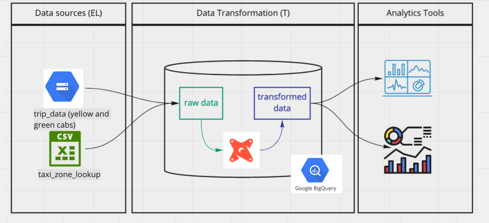
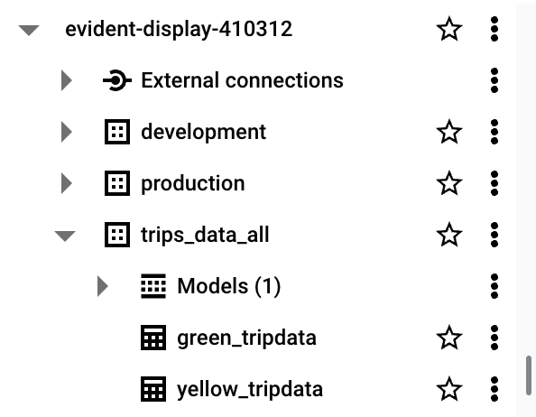
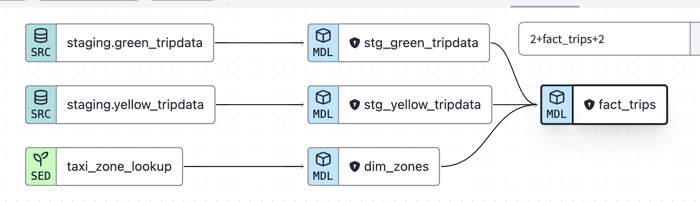

N.b. Project from this week is held within the `taxi_rides_ny_bq` subdirectory

### Table of Contents


# Introduction to Analytics Engineering

## What is Analytics Engineering

As the _data domain_ has developed over time, new tools have been introduced that have changed the dynamics of working with data:

1. Massively parallel processing (MPP) databases
    * Lower the cost of storage 
    * BigQuery, Snowflake, Redshift...
1. Data-pipelines-as-a-service
    * Simplify the ETL process
    * Fivetran, Stitch...
1. SQL-first / Version control systems
    * Looker...
1. Self service analytics
    * Mode...
1. Data governance

The introduction of all of these tools changed the way the data teams work as well as the way that the stakeholders consume the data, creating a gap in the roles of the data team. Traditionally:

* The ***data engineer*** prepares and maintains the infrastructure the data team needs.
* The ***data analyst*** uses data to answer questions and solve problems (they are in charge of _today_).
* The ***data scientist*** predicts the future based on past patterns and covers the what-ifs rather than the day-to-day (they are in charge of _tomorrow_).

However, with the introduction of these tools, both data scientists and analysts find themselves writing more code even though they're not software engineers and writing code isn't their top priority.  Data engineers are good software engineers but they don't have the training in how the data is going to be used  by the business users.

The ***analytics engineer*** is the role that tries to fill the gap: it introduces the good software engineering practices to the efforts of data analysts and data scientists. The analytics engineer may be exposed to the following tools:
1. Data Loading (Stitch...)
1. Data Storing (Data Warehouses - Snowflake, BigQuery, Redshift)
1. Data Modeling (dbt, Dataform...)
1. Data Presentation (BI tools like Looker, Mode, Tableau...)

This lesson focuses on the last 2 parts: Data Modeling and Data Presentation.

## Data Modeling Concepts

### ETL v ELT

ETL 
* Transform the data before loading it into the data warehouse
* More stable + compliant data analysis
* Higher storage and compute costs

ELT
* Extract the data from sources and immediately load it to the data warehouse -> then transform the data
* Faster and more flexible data analysis
* Lower cost and lower maintenance

### Dimensional Modeling 

[Ralph Kimball's Dimensional Modeling](https://www.wikiwand.com/en/Dimensional_modeling#:~:text=Dimensional%20modeling%20(DM)%20is%20part,use%20in%20data%20warehouse%20design.) is an approach to Data Warehouse design which focuses on 2 main points:
* Deliver data which is understandable to the business users.
* Deliver fast query performance.

Other goals such as reducing redundant data (prioritized by other approaches such as [3NF](https://www.wikiwand.com/en/Third_normal_form#:~:text=Third%20normal%20form%20(3NF)%20is,integrity%2C%20and%20simplify%20data%20management.) by [Bill Inmon](https://www.wikiwand.com/en/Bill_Inmon)) are secondary to these goals. Dimensional Modeling also differs from other approaches to Data Warehouse design such as [Data Vaults](https://www.wikiwand.com/en/Data_vault_modeling).

Dimensional Modeling is based around 2 important concepts:
* ***Fact Table***:
    * _Facts_ = _Measures_
    * Typically numeric values which can be aggregated, such as measurements or metrics.
        * Examples: sales, orders, etc.
    * Corresponds to a [_business process_ ](https://www.wikiwand.com/en/Business_process).
    * Can be thought of as _"verbs"_.
* ***Dimension Table***:
    * _Dimension_ = _Context_
    * Groups of hierarchies and descriptors that define the facts.
        * Example: customer, product, etc.
    * Corresponds to a _business entity_.
    * Can be thought of as _"nouns"_.
* Dimensional Modeling is built on a [***star schema***](https://www.wikiwand.com/en/Star_schema) with fact tables surrounded by dimension tables.

E.g. Sales as thr Fact Table
* Dimensions tables of product, customer, date 

A good way to understand the _architecture_ of Dimensional Modeling is by drawing an analogy between dimensional modeling and a restaurant:
* Stage Area:
    * Contains the raw data.
    * Not meant to be exposed to everyone.
    * Similar to the food storage area in a restaurant.
* Processing area:
    * From raw data to data models.
    * Focuses in efficiency and ensuring standards.
    * Similar to the kitchen in a restaurant.
* Presentation area:
    * Final presentation of the data.
    * Exposure to business stakeholder.
    * Similar to the dining room in a restaurant.


# Introduction to DBT

## What is DBT?

***dbt*** stands for ***data build tool***. It's a _transformation_ tool: it allows us to transform process _raw_ data in our Data Warehouse to _transformed_ data which can be later used by Business Intelligence tools and any other data consumers.

dbt also allows us to introduce good software engineering practices (e.g. modularity + portability) by defining a _deployment workflow_:
1. Develop models
1. Test and document models
1. Deploy models with _version control_ and _CI/CD_.

## How does DBT work?

dbt works by defining a ***modeling layer*** that sits on top of our Data Warehouse. The modeling layer will turn _tables_ into ***models*** which we will then transform into _derived models_, which can be then stored in the Data Warehouse for persistence.

A ***model*** is a .sql file with a `SELECT` statement; no DDL or DML is used. dbt will compile the file and run it in our Data Warehouse.

## How to use dbt?

dbt has 2 main components: _dbt Core_ and _dbt Cloud_:
* ***dbt Core***: open-source project that allows the data transformation.
    * Builds and runs a dbt project (.sql and .yaml files).
    * Includes SQL compilation logic, macros and database adapters.
        * n.b. macros -> functions
    * Includes a CLI interface to run dbt commands locally.
    * Open-source and free to use.
* ***dbt Cloud***: SaaS application to develop and manage dbt projects.
    * Web-based IDE to develop, run and test a dbt project.
    * Jobs orchestration.
    * Logging and alerting.
    * Intregrated documentation.
    * Free for individuals (one developer seat).

For integration with BigQuery we will use the dbt Cloud IDE, so a local installation of dbt core isn't required. For developing locally rather than using the Cloud IDE, dbt Core is required. Using dbt with a local Postgres database can be done with dbt Core, which can be installed locally and connected to Postgres and run models through the CLI.




# Setting up DBT

## Updating BigQuery Dataset

Used parameterized_flow.py (running with prefect) to load yellow and green taxi ride data for months 1,2,3 of 2021 (6 files in total) into dtc_data_lake_evident-display-410312 bucket.

Created 2 external tables in BigQuery from these 3 files - `green_tripdata` and `yellow_tripdata`. Both held within the trips_datal_all schema:

```sql
CREATE OR REPLACE EXTERNAL TABLE `evident-display-410312.trips_data_all.green_tripdata`
OPTIONS (
  format = 'PARQUET',
  uris = ['gs://dtc_data_lake_evident-display-410312/data/green/green_tripdata_2021-*.parquet']
);

CREATE OR REPLACE EXTERNAL TABLE `evident-display-410312.trips_data_all.yellow_tripdata`
OPTIONS (
  format = 'PARQUET',
  uris = ['gs://dtc_data_lake_evident-display-410312/data/yellow/yellow_tripdata_2021-*.parquet']
);
```

Created 2 new datasets - development and production 




## Establishing connection between BigQuery/Github and DBT + Initialising Project

**Using DBT Cloud**

In order to use dbt Cloud you will need to create a user account. Got to the [dbt homepage](https://www.getdbt.com/) and sign up.

During the sign up process, asked to create a starter project and connection to a database
* Followed the instructions in `dbt_cloud_setup.md` to connect to BigQuery
    * Useed dbt-service-account as the service account name
        * email: dbt-service-account@evident-display-410312.iam.gserviceaccount.com
        * gave the service account BQ admin rights

Make sure that you set up a GitHub repo for your project. In _Account settings_ > _Projects_ you can select your project and change its settings, such as _Name_ or _dbt Project Subdirectoy_, which can be convenient if your repo is previously populated and would like to keep the dbt project in a single subfolder -> **my subdirectory for this project is `taxi_rides_ny_bq`**

In the IDE windows, press the green _Initilize_ button to create the project files. Inside `dbt_project.yml`, change the project name both in the `name` field as well as right below the `models:` block. You may comment or delete the `example` block at the end.
* Have to create a branch - DBT IDE doesn't let you edit in main branch 

## Using DBT Core

**Using DBT Cloud instead in this course**

Installing dbt Core locally can be done following the steps in [the official docs](https://docs.getdbt.com/dbt-cli/install/overview). More instructions are also available [in this link](https://github.com/DataTalksClub/data-engineering-zoomcamp/tree/main/week_4_analytics_engineering/docker_setup).

Starting a dbt project with dbt Core involves creating a `profiles.yml` file manually before running `dbt init`. Check the video on [using dbt core + postgres](https://www.youtube.com/watch?v=1HmL63e-vRs&list=PL3MmuxUbc_hJed7dXYoJw8DoCuVHhGEQb&index=37) for more info.

# Developing with DBT

## Anatomy of a DBT model

dbt models are mostly written in SQL (remember that a dbt model is essentially a `SELECT` query) but they also make use of the [Jinja templating language](https://jinja.palletsprojects.com/en/3.0.x/) for templates.
* Jinja is also used in Airflow
* A Jinja block is enclosed with {{}}

```sql
{{
    config(materialized='table')
}}

SELECT *
FROM staging.source_table
WHERE record_state = 'ACTIVE'
```

* In the Jinja statement defined within the `{{ }}` block we call the [`config()` function](https://docs.getdbt.com/reference/dbt-jinja-functions/config).
    * More info about Jinja macros for dbt [in this link](https://docs.getdbt.com/docs/building-a-dbt-project/jinja-macros).
* We commonly use the `config()` function at the beginning of a model to define a ***materialization strategy***: a strategy for persisting dbt models in a warehouse.
    * The `table` strategy means that the model will be rebuilt as a table on each run.
    * We could use a `view` strategy instead, which would rebuild the model on each run as a SQL view.
    * The `incremental` strategy is essentially a `table` strategy but it allows us to add or update records incrementally rather than rebuilding the complete table on each run.
    * The `ephemeral` strategy creates a _[Common Table Expression](https://www.essentialsql.com/introduction-common-table-expressions-ctes/)_ (CTE).
    * You can learn more about materialization strategies with dbt [in this link](https://docs.getdbt.com/docs/building-a-dbt-project/building-models/materializations). Besides the 4 common `table`, `view`, `incremental` and `ephemeral` strategies, custom strategies can be defined for advanced cases.

dbt will compile this code into the following SQL query:

```sql
CREATE TABLE my_schema.my_model AS (
    SELECT *
    FROM staging.source_table
    WHERE record_state = 'ACTIVE'
)
```

After the code is compiled, dbt will run the compiled code in the Data Warehouse.

Additional model properties are stored in YAML files. Traditionally, these files were named `schema.yml` but later versions of dbt do not enforce this as it could lead to confusion.

## The FROM Clause

The `FROM` clause within a `SELECT` statement defines the _sources_ of the data to be used.

The following sources are available to dbt models:

* ***Sources***: The data loaded within our Data Warehouse.
    * We can access this data with the `source()` function.
    * The `sources` key in our YAML file contains the details of the databases that the `source()` function can access and translate into proper SQL-valid names.
        * Additionally, we can define "source freshness" to each source so that we can check whether a source is "fresh" or "stale", which can be useful to check whether our data pipelines are working properly.
    * More info about sources [in this link](https://docs.getdbt.com/docs/building-a-dbt-project/using-sources).
* ***Seeds***: CSV files which can be stored in our repo under the `seeds` folder.
    * The repo gives us version controlling along with all of its benefits.
    * Seeds are best suited to static data which changes infrequently.
    * Seed usage:
        1. Add a CSV file to your `seeds` folder.
        1. Run the [`dbt seed` command](https://docs.getdbt.com/reference/commands/seed) to create a table in our Data Warehouse.
            * If you update the content of a seed, running `dbt seed` will append the updated values to the table rather than substituing them. Running `dbt seed --full-refresh` instead will drop the old table and create a new one.
        1. Refer to the seed in your model with the `ref()` function.
    * More info about seeds [in this link](https://docs.getdbt.com/docs/building-a-dbt-project/seeds).

Here's an example of how you would declare a source in a `.yml` file:

```yaml
sources:
    - name: staging
      database: production
      schema: trips_data_all

      loaded_at_field: record_loaded_at
      tables:
        - name: green_tripdata
        - name: yellow_tripdata
          freshness:
            error_after: {count: 6, period: hour}
```

And here's how you would reference a source in a `FROM` clause:

```sql
FROM {{ source('staging','yellow_tripdata') }}
```
* The first argument of the `source()` function is the source name, and the second is the table name.

In the case of seeds, assuming you've got a `taxi_zone_lookup.csv` file in your `seeds` folder which contains `locationid`, `borough`, `zone` and `service_zone`:

```sql
SELECT
    locationid,
    borough,
    zone,
    replace(service_zone, 'Boro', 'Green') as service_zone
FROM {{ ref('taxi_zone_lookup) }}
```

The `ref()` macro is a function that references underlying tables and views in the Data Warehouse. When compiled, it will automatically build the dependencies and resolve the correct schema fo us. So, if BigQuery contains a schema/dataset called `dbt_dev` inside the `my_project` database which we're using for development and it contains a table called `stg_green_tripdata`, then the following code...

```sql
WITH green_data AS (
    SELECT *,
        'Green' AS service_type
    FROM {{ ref('stg_green_tripdata') }}
),
```

...will compile to this:

```sql
WITH green_data AS (
    SELECT *,
        'Green' AS service_type
    FROM "my_project"."dbt_dev"."stg_green_tripdata"
),
```
* The `ref()` function translates our references table into the full reference, using the `database.schema.table` structure.
* If we were to run this code in our production environment, dbt would automatically resolve the reference to make ir point to our production schema.

## Defining a Source and creating a Model

We will now create our first model.

We will begin by creating 2 new folders under our `models` folder:
* `staging` will have the raw models.
* `core` will have the models that we will expose at the end to the BI tool, stakeholders, etc.

Under `staging` we will add 2 new files: `sgt_green_tripdata.sql` and `schema.yml`:
```yaml
# schema.yml

version: 2

sources:
    - name: staging
      database: evident-display-410312
      schema: trips_data_all

      tables:
          - name: green_tripdata
          - name: yellow_tripdata
```
* We define our ***sources*** in the `schema.yml` model properties file.
* for bigquery, the database = the project id 
* We are defining the 2 tables for yellow and green taxi data as our sources.

```sql
-- sgt_green_tripdata.sql

{{ config(materialized='view') }}

select * from {{ source('staging', 'green_tripdata') }}
limit 100
```
* This query will create a ***view*** in the `staging` dataset/schema in our database.
* We make use of the `source()` function to access the green taxi data table, which is defined inside the `schema.yml` file.
* A lineage is created tracking the source (green_tripdata in BigQuery) to the Model (stg_green_tripdata)

The advantage of having the properties in a separate file is that we can easily modify the `schema.yml` file to change the database details and write to different databases without having to modify our `sgt_green_tripdata.sql` file.

You can now run the model with the `dbt run` command, either locally or from dbt Cloud:

```dbt
dbt run -m stg_green_tripdata
```
* just doing: `dbt run` would run every model that you have 

**stg_green_tripdata now appears in the development Dataset in BigQuery**
- configured in dbt for new models to be created in the `development` dataset (Cogwheel => Account settings => Credentials => Edit => Dataset)

## Macros

***Macros*** are pieces of code in Jinja that can be reused, similar to functions in other languages.

dbt already includes a series of macros like `config()`, `source()` and `ref()`, but custom macros can also be defined.

Macros allow us to add features to SQL that aren't otherwise available, such as:
* Use control structures such as `if` statements or `for` loops.
* Use environment variables in our dbt project for production.
* Operate on the results of one query to generate another query.
* Abstract snippets of SQL into reusable macros.

Macros are defined in separate `.sql` files which are typically stored in a `macros` directory.

There are 3 kinds of Jinja _delimiters_:
* `` for ***statements*** (control blocks, macro definitions)
* `{{ ... }}` for ***expressions*** (literals, math, comparisons, logic, macro calls...)
* `{# ... #}` for comments.

Here's a macro definition example:

```sql
{# This macro returns the description of the payment_type #}



    case {{ payment_type }}
        when 1 then 'Credit card'
        when 2 then 'Cash'
        when 3 then 'No charge'
        when 4 then 'Dispute'
        when 5 then 'Unknown'
        when 6 then 'Voided trip'
    end


```
* The `macro` keyword states that the line is a macro definition. It includes the name of the macro as well as the parameters.
* The code of the macro itself goes between 2 statement delimiters. The second statement delimiter contains an `endmacro` keyword.
* In the code, we can access the macro parameters using expression delimiters.
* The macro returns the ***code*** we've defined rather than a specific value.

Here's how we use the macro:
```sql
select
    {{ get_payment_type_description('payment_type') }} as payment_type_description,
    congestion_surcharge::double precision
from {{ source('staging','green_tripdata') }}
where vendorid is not null
```
* We pass a `payment-type` variable which may be an integer from 1 to 6.

And this is what it would compile to:
```sql
select
    case payment_type
        when 1 then 'Credit card'
        when 2 then 'Cash'
        when 3 then 'No charge'
        when 4 then 'Dispute'
        when 5 then 'Unknown'
        when 6 then 'Voided trip'
    end as payment_type_description,
    congestion_surcharge::double precision
from {{ source('staging','green_tripdata') }}
where vendorid is not null
```
* The macro is replaced by the code contained within the macro definition as well as any variables that we may have passed to the macro parameters.

**Note:** You can see the compiled code in the target folder - this shows the compiled code for each of your models
- I.e. replacing any macros / packages with the sql that underlies it
    - Can be interesting for packages - you can see the code underlying the imported function you've used
- this target folder by default is included in the .gitignore file - it won't be pushed to your remote repo 
- The same is true for the packages folder (created when you install packages - see below) - it's by default included in the .gitignore 

## Packages

Macros can be exported to ***packages***, similarly to how classes and functions can be exported to libraries in other languages. Packages contain standalone dbt projects with models and macros that tackle a specific problem area.

When you add a package to your project, the package's models and macros become part of your own project. A list of useful packages can be found in the [dbt package hub](https://hub.getdbt.com/).

To use a package, you must first create a `packages.yml` file in the root of your work directory. Here's an example:
```yaml
packages:
  - package: dbt-labs/dbt_utils
    version: 0.8.0
```

After declaring your packages, you need to install them by running the `dbt deps` command either locally or on dbt Cloud.

You may access macros inside a package in a similar way to how Python access class methods:
```sql
select
    {{ dbt_utils.surrogate_key(['vendorid', 'lpep_pickup_datetime']) }} as tripid,
    cast(vendorid as integer) as vendorid,
    -- ...
```
* The `surrogate_key()` macro generates a hashed [surrogate key](https://www.geeksforgeeks.org/surrogate-key-in-dbms/) with the specified fields in the arguments.

## Variables

Like most other programming languages, ***variables*** can be defined and used across our project.

Variables can be defined in 2 different ways:
* Under the `vars` keyword inside `dbt_project.yml`.
    ```yaml
    vars:
        payment_type_values: [1, 2, 3, 4, 5, 6]
    ```
* As arguments when building or running your project.
    ```sh
    dbt build --m <your-model.sql> --var 'is_test_run: false'
    ```

Variables can be used with the `var()` macro. For example:
```sql


    limit 100


```
* In this example, the default value for `is_test_run` is `true`; in the absence of a variable definition either on the `dbt_project.yml` file or when running the project, then `is_test_run` would be `true`.
* Since we passed the value `false` when runnning `dbt build`, then the `if` statement would evaluate to `false` and the code within would not run.

## Creating and Using DBT seed / Unioning the two staging models 

>Note: you will need the [Taxi Zone Lookup Table seed](https://s3.amazonaws.com/nyc-tlc/misc/taxi+_zone_lookup.csv) (use [this](https://github.com/DataTalksClub/nyc-tlc-data/releases/download/misc/taxi_zone_lookup.csv) link if the first doesn't work), the 2 staging models and schema created earlier (`stg_green_tripdata` and `stg_yellow_tripdata`) and the macro created earlier (`get_payment_type_description`) for this section.

Add the taxi zone lookup csv to the seed folder. Then run `db seed` and the lookup table is created in BigQuery

To update a field type in a seed, can edit the dbt_project.yml file:

```yaml
seeds:
  taxi_rides_ny:
    taxi_zone_lookup:
      +column_types:
        locationid: numeric
```

If you want to update data in the seed, edit the file in dbt, and then run `dbt seed --full-refresh` in order to drop the table in BigQuery and recreate it
- the default is to append data to the seed - so any changed rows would simply be appended; and the old data would remain 

The models we've created in the _staging area_ are for normalizing the fields of both green and yellow taxis. With normalized field names we can now join the 2 together in more complex ways.

The `ref()` macro is used for referencing any undedrlying tables and views that we've created, so we can reference seeds as well as models using this `ref()` macro.

The `dim_zones.sql` model in the core subfolder of the models folder:

```sql
{{ config(materialized='table') }}

select
    locationid,
    borough,
    zone,
    replace(service_zone, 'Boro', 'Green') as service_zone
from {{ ref('taxi_zone_lookup') }}
```
* This model references the `taxi_zone_lookup` table created from the taxi zone lookup CSV seed.

```sql
with green_data as (
    select *, 
        'Green' as service_type 
    from {{ ref('stg_green_tripdata') }}
), 
```
* This snippet references the `stg_green_tripdata` model that we've created before. Since a model outputs a table/view, we can use it in the `FROM` clause of any query.

You may check out these more complex "core" models in the core subdirectory of taxi_rides_ny_bq or 04/analytics-engineering/taxi_rides_ny.
- it unions the green and yellow taxi ride tables
- It then uses the taxi_zone_lookup table to join location data onto the above unioned table for both pickup and drop-off

Here, you can see the data lineage across the models we've built up to this point:



>Note: running `dbt run` will run all models but NOT the seeds. The `dbt build` can be used instead to run all seeds and models as well as tests, which we will cover later. Additionally, running `dbt run --select my_model` will only run the model itself, but running `dbt run --select +my_model` will run the model as well as all of its dependencies.

# Testing and documenting dbt models

Testing and documenting are not required steps to successfully run models, but they are expected in any professional setting.

## Testing

Tests in dbt are ***assumptions*** that we make about our data.

In dbt, tests are essentially a `SELECT` query that will return the amount of records that fail because they do not follow the assumption defined by the test.

Tests are defined on a column in the model YAML files (like the `schema.yml` file we defined before). dbt provides a few predefined tests to check column values but custom tests can also be created as queries. Here's an example test:

```yaml
models:
  - name: stg_yellow_tripdata
    description: >
        Trips made by New York City's iconic yellow taxis. 
    columns:
        - name: tripid
        description: Primary key for this table, generated with a concatenation of vendorid+pickup_datetime
        tests:
            - unique:
                severity: warn
            - not_null:
                severrity: warn
```
* The tests are defined for a column in a specific table for a specific model.
* There are 2 tests in this YAML file: `unique` and `not_null`. Both are predefined by dbt.
* `unique` checks whether all the values in the `tripid` column are unique.
* `not_null` checks whether all the values in the `tripid` column are not null.
* Both tests will return a warning in the command line interface if they detect an error.
* 2 other tests that dbt provides:
    * Accepted values (you can provide a list of accepted values and check that the values in a column are all in that list)
    * Foreign key to another table

Here's wwhat the `not_null` will compile to in SQL query form:

```sql
select *
from "my_project"."dbt_dev"."stg_yellow_tripdata"
where tripid is null
```

You may run tests with the `dbt test` command.

## Documentation

dbt also provides a way to generate documentation for your dbt project and render it as a website.

You may have noticed in the previous code block that a `description:` field can be added to the YAML field. dbt will make use of these fields to gather info.

The dbt generated docs will include the following:
* Information about the project:
    * Model code (both from the .sql files and compiled code)
    * Model dependencies
    * Sources
    * Auto generated DAGs from the `ref()` and `source()` macros
    * Descriptions from the .yml files and tests
* Information about the Data Warehouse (`information_schema`):
    * Column names and data types
    * Table stats like size and rows

dbt docs can be generated on the cloud or locally with `dbt docs generate`, and can be hosted in dbt Cloud as well or on any other webserver with `dbt docs serve`.


**Note:**

Amended the code in `stg_green_tripdata` and `stg_yellow_tripdata.sql` to account for potential duplicates in the source data - the csvs for yellow and green taxi rides:

```sql
with tripdata as 
(
  select *,
    row_number() over(partition by cast(vendorid as integer), tpep_pickup_datetime) as rn
  from {{ source('staging','yellow_tripdata') }}
  where vendorid is not null 
)
```
* This goes at the top of the code, as a CTE
* You then use the same select statement as before, and just amend the FROM statement
* cast vendorid as an integer because partitioning by expressions of type float not allowed

```sql
from tripdata
where rn = 1
```
* The idea is that if there are any duplicate rows (with the same vendorid and tpep_pickup_datetime), the duplicates will have an rn that is 2,3 etc. and thus will be filtered out of the final select statement.


# Deploying a DBT project


