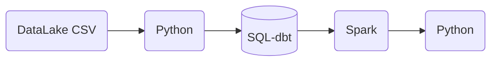
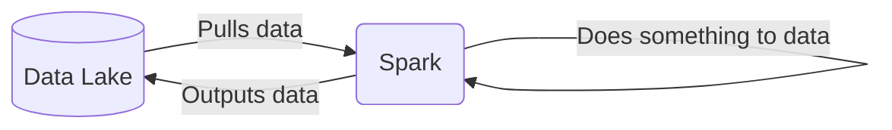
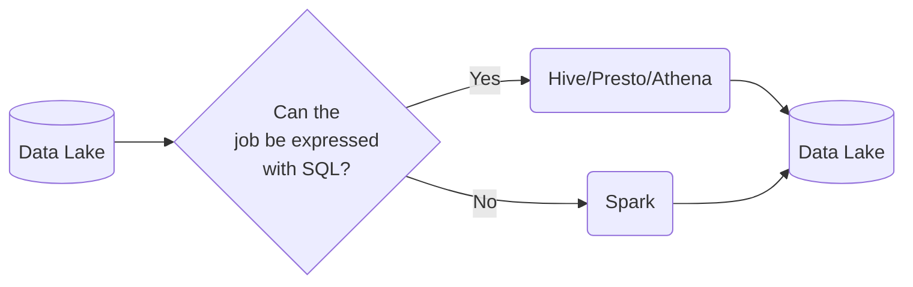
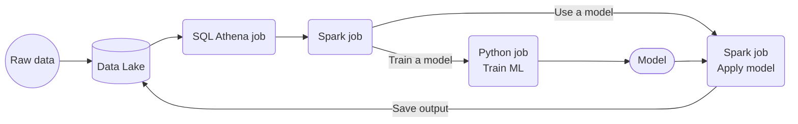

### Contents

- [Introduction to Spark](#introduction-to-spark)
    - [What we're covering this week](#what-were-covering-this-week)
    - [Batch v Streaming](#batch-vs-streaming)
    - [Types of Batch Jobs](#types-of-batch-jobs)
    - [Orchestrating Batch Jobs](#orchestrating-batch-jobs)
    - [Pros and Cons of Batch Jobs](#pros-and-cons-of-batch-jobs)
- [Introduction to Spark](#introduction-to-spark)
    - [What is Spark](#what-is-spark)

# Introduction to Spark

## What we're covering this week:

- Spark, Spark DataFrames, and Spark SQL
- Joins in Spark
- Resilient Distributed Datasets (RDDs)
- Spark internals
- Spark with Docker
- Running Spark in the Cloud
- Connecting Spark to a Data Warehouse (DWH)

## Batch vs Streaming

There are 2 ways of processing data:
* ***Batch processing***: processing _chunks_ of data at _regular intervals_.
    * Example: processing taxi trips each month.
        ```mermaid
        graph LR;
            a[(taxi trips DB)]-->b(batch job)
            b-->a
        ```
* ***Streaming***: processing data _on the fly_.
    * Example: processing a taxi trip as soon as it's generated.
        ```mermaid
        graph LR;
            a{{User}}-. gets on taxi .->b{{taxi}}
            b-- ride start event -->c([data stream])
            c-->d(Processor)
            d-->e([data stream])
        ```

This week will cover ***batch processing***. Next week will cover streaming.

## Types of Batch Jobs


A batch job is a job that will process data in batches. They can be scheduled e.g. weekly, daily (common), hourly (common), x times per hour, etc.

Batch jobs may also be created using:

* Python scripts
    * Python scripts can be run anywhere (Kubernets, AWS Batch, ...)
* SQL - as you'd do in DBT
* Spark (what we will use for this lesson)
* Flink
* Etc...

## Orchestrating Batch Jobs

A common workflow might involve:



Each step would involve batch processing - and would be orchestrated via e.g. Mage, Prefect, Airflow

## Pros and cons of batch jobs

* Advantages:
    * Easy to manage. There are multiple tools to manage them (the technologies we already mentioned)
    * Re-executable. Jobs can be easily retried if they fail.
    * Scalable. Scripts can be executed in more capable machines; Spark can be run in bigger clusters, etc.
* Disadvantages:
    * Delay. Each task of the workflow in the previous section may take a few minutes; assuming the whole workflow takes 20 minutes, we would need to wait those 20 minutes until the data is ready for work.

Most companies that deal with data tend to work with batch jobs most of the time (probably 90%) - it's good enough for most things.

# Introduction to Spark

## What is Spark?

[Apache Spark](https://spark.apache.org/) is an open-source ***multi-language*** unified analytics ***engine*** for large-scale data processing.

Spark is an ***engine*** because it _processes data_.



Spark can be ran in _clusters_ with multiple _nodes_, each pulling and transforming data.

Spark is ***multi-language*** because we can use Java and Scala natively, and there are wrappers for Python, R and other languages.

The wrapper for Python is called [PySpark](https://spark.apache.org/docs/latest/api/python/).

Spark can deal with both batches and streaming data. Streaming data can be seen as a sequence of small batches, and so you can apply similar techniques as those that are used for regulat batches. 

## Why do we need Spark?

Spark is used for transforming data in a Data Lake.

There are tools such as Hive, Presto or Athena (an AWS managed Presto) that allow you to express jobs as SQL queries. However, there are times where you need to apply more complex manipulation which are very difficult or even impossible to express with SQL (such as ML models); in those instances, Spark is the tool to use.



A typical workflow may combine both tools. Here's an example of a workflow involving Machine Learning:



In this scenario, most of the preprocessing would be happening in Athena, so for everything that can be expressed with SQL, it's always a good idea to do so, but for everything else, there's Spark.

# Installing Spark

Installed Java and Spark on my GCP VM - using the instructions from [linux.md](../05-batch/setup/linux.md).

Instructions for MacOS and Windows are also available in the setup folder of week 5.

After installing the appropriate JDK (Java) and Spark, set up PySpark using the following [instructions](../05-batch/setup/pyspark.md)

# First Look at Spark/Pyspark 

## Initial Set Up

Using Jupyter Notebooks. Before running `jupter notebook` in the terminal, run the following commands to ensure that you can import pyspark in your notebook:

```
export PYTHONPATH="${SPARK_HOME}/python/:$PYTHONPATH" 
export PYTHONPATH="${SPARK_HOME}/python/lib/py4j-0.10.9.5-src.zip:$PYTHONPATH"
```
- see [pyspark.md](../05-batch/setup/pyspark.md) for more info on this

Then run `jupyter notebook` and open up a notebook in your browser

## Creating a Spark Session

In your notebook - using [04_pyspark](../05-batch/code/04_pyspark.ipynb)


