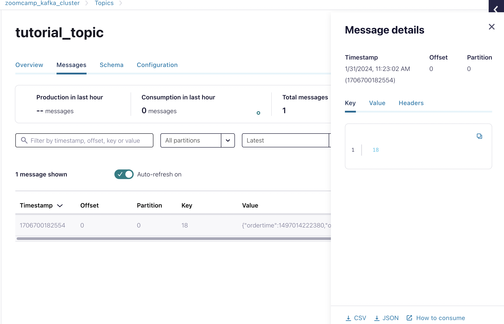

### Contents

- [Introduction to Stream Processing](#introduction-to-stream-processing)
    - [What is Stream Processing](#what-is-stream-processing)
- [Introduction to Kafka](#introduction-to-kafka)
    - [What is Kafka](#what-is-kafka)
    - [Confluent Cloud](#confluent-cloud)
        - [Create an API Key](#create-an-api-key)
        - [Create a Topic](#create-a-topic)
        - [Produce a new message](#produce-a-new-message)
        - [Create a Connector](#create-a-connector)
        - [Return to the topic](#return-to-the-topic)
        - [Shut down the Connector](#shut-down-the-connector)
    - [Kafka Producer Consumer]
    

# Introduction to Stream Processing

## What is Stream Processing?

Data exchange: one computer is sharing some sort of information/data with receivers, generally by SPI - whether Rest, GraphQl, webhooks

Real world E.g. Noticeboards
- Producer goes and pins up a notice on the noticeboard
- On the other side there are consumers/users who can read that information and then take any action they see necessary / or ignore it
- Adding topics:
    - A producer could takr their flyer and attach it to a certain topic on the noticeboard
    - A consumer that is subscribed to that topic will then get that information

In the previous case, information is shared in batch mode - consumer sees the added information whenever they pass the noticeboard 
- In stream processing the data is exchanged more in real time i.e. a topic receives information from a producer and this information is immediately given to the consumer
- To define real time: might be a few seconds of delay, but no more than that

# Introduction to Kafka 

## What is Kafka

Topic - a continuous stream of events
Event - a single data point
- e.g. we've built an app that records the temperature of a room every 30 seconds. An event is then the temperature of the room at a particular timestamp 
Logs - the way we store events in a topic 
Messages - each event contains something called a message (which can have different properties - different required + non-required fields)
- In the above example the message is the timestamp + the temperature of the room
- A message gas 3 structures:
    1. Key - used for partitioning 
    2. Value - the actual data (temp + timestamp)
    3. Timestamp - when the message was sent

What does Kafka provide that other streaming platforms / APIs don't?
- Robustness + reliability to your topic -> even if servers + nodes go down you'll still receive the data -> due to replication 
    - Kafka replicates data across different fields
- Flexibility - topics can be super small or big; can have 1 or 100s of consumers; it's integrations e.g. Kafka connect, ksqlDB; can store data in tier storage (use lower, cheaper tier for data you don't access very often)
- Scalability - Kafka can handle 1000s of events per second

Messages are sustained within a Kafka topic - one consumer reading a message doesn't mean that other consumers can't also read the message

The need of stream processing:
- Used to have monolith architecture -> now we have microservice achitecture
- Microservice architecture = lots of smaller applications
- These microservices need to talk to each other via e.g. APIs, message pass, central databases
- The more microservices you have, the messier this gets - you need a common message pass
- This message pass can be Kafka 
    - Microservices write to a Kafka topic (as a producer)
    - Any microservice can then subscribe to the topics they need information from 

Kafka also provides CDC - change data capture 
- A central database can write to Kafka topics and any microservices can read from the topics they are interested in 

## Confluent Cloud

Set up Confluent Cloud free trial - which allows you to have a Kafka cluster which you can connect on conflict cloud
- Reason why we're using confluent cloud - free for 30 days + easy to connect with our GCP account

I used my google account to create a confluent cloud account

**Have the option of instead using docker-compose to install kafka**

Create first cluster
- using GCP
- Select a region near you (I chose London - europe-west2)
- Singlw zone availability
- Named it `zoomcamp-kafka-cluster`
- Click Launch Cluster

Here's the Cluster Overview page:

### Create an API Key

An API key consists of a key and a secret. Kafka API keys are required to interact with Kafka clusters in Confluent
Cloud. Each Kafka API key is valid for a specific Kafka cluster.

Click on **API Keys** and on **Create key** button.

Select **Global access** and click on **Next** button.

Enter the following description: `kafka_cluster_tutorial_api_key`.

Click on **Download and continue** button.

Our key is downloaded. You should also see in **Cluster Settings** the **Endpoints** Bootstrap server and REST endpoint.

### Create a Topic

A Topic is a category/feed name to which records are stored and published. All Kafka records are organized into topics.
Producer applications write data to topics and consumer applications read from topics. Records published to the cluster
stay in the cluster until a configurable retention period has passed by.

Select **Topics** in the left menu, and click on **Create topic** button.

In the **New topic form**, enter :

- **Topic name** : tutorial_topic
- **Partitions** : 2
- Click on **Show advanced settings**
- **Retention time**: 1 day
    - there's an option for this to be infinite
- Click on **Save & create** button.

### Produce a new message

Now, we can produce some new messages.

Select the **Messages** tab, click on **+ Produce a new message to this topic**.

Click on **Produce** button.

The message produced has a **Value**, an empty **Header** and a **Key**.

Also partition, offset and timestamp attached to the message

### Create a Connector

Confluent Cloud offers pre-built, fully managed Kafka connectors that make it easy to instantly connect your clusters to
popular data sources and sinks. Connect to external data systems effortlessly with simple configuration and no ongoing
operational burden.

Select **Connectors** in the left menu, and click on **Datagen Source**.

Select **tutorial_topic** and click on the **Continue** button.

Select **Global access** and click on the **Continue** button.

Under **Select output record value format**, select **JSON**. Under **Select a template**, select **Orders**. Click on
**Continue** button.

The instructor says that the **Connector sizing** is fine. Click on **Continue** button.

Change the **Connector name** for `OrdersConnector_tutorial` and click on **Continue** button.

You should now see this:

The connector is being provisioned. This may take 2 or 3 minutes.

Click on the **OrderConnector_tutorial** connector. You should see that the connector is active / running

Now that the connector is up and running, you can click on **Explore metrics** button and explore the data being produced

### Return to the topic

Select the **tutorial_topic** that we just configured the connector to produce to, to view more details.

Under **Overview** tab, we see the production rate (523 bytes per second) and consumption rate (0 bytes) as bytes per second.
- We don't have any consumers set up

Under **Messages** tab, we see that a number of messages have been created.

<table>
<tr><td>

</td><td>

</td></tr>
</table>

### Shut down the connector

Select **Connectors** in the left menu, select our connector **OrdersConnector_tutorial**, and click on **Pause**
button.

We always have to stop processes at the end of a work session so we don’t burn our \$400 free credit dollars.

See also [Confluent Cloud](https://docs.confluent.io/cloud/current/overview.html) and [Confluent
Documentation](https://docs.confluent.io/home/overview.html).

## Kafka Producer Consumer

We will:
- Produce some messages programmatically
- Consume some data programmatially

Will be using the NY taxi data set

Will be using Java rather than Python - Java libraries well maintained for Kafka, whereas Python is not at the moment
- There are also python examples from previous years, if you'd like to use those instead - almost the same thing. All is in the `06-streaming` folder.
- Can also use Docker instead of Confluent Cloud for your Kafka cluster 

### Create a topic with Confluent cloud

Login to [Confluent Cloud](https://confluent.cloud/).

From the **Welcome back** page, click on **Environments**, select the **Default cluster**, click on
**kafka_tutorial_cluster** and select **Topics** in the left menu.

Click on **Add topic** button.

In the **New topic form**, enter :

- **Topic name** : rides
- **Partitions** : 2
- Click on **Show advanced settings**
- **Retention time**: 1 day

Click on **Save & create** button.

This topic has no messages, schema or configuration.

### Create a Client

